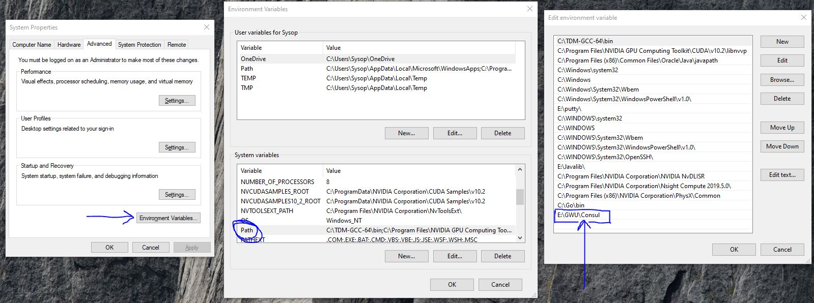
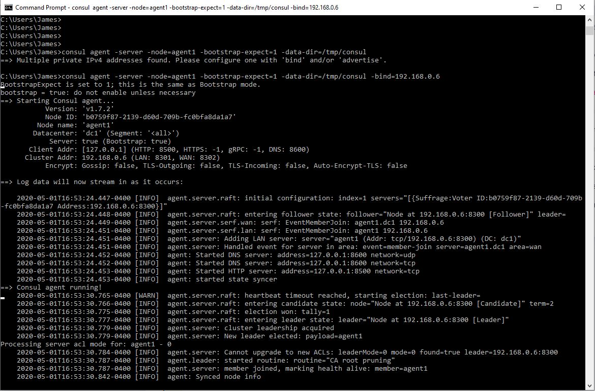
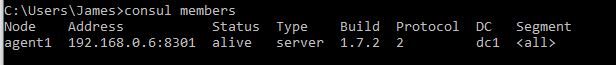
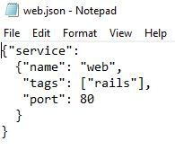
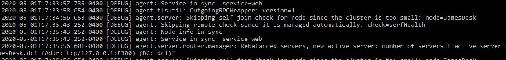
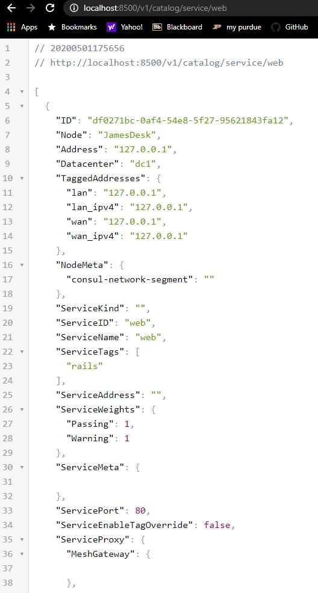
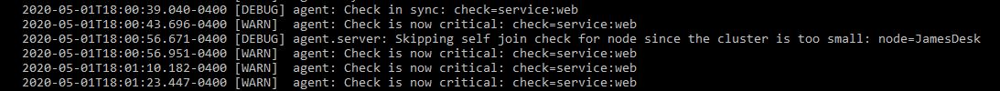

---
layout: page
title:  An Intro to Consul Agents, Data-centers, and Services
permalink: /wiki/Consul101Blog/
---

*by:* James Levy

Hi, welcome to YATB (Yet Another Tech Blog) by James Levy. Today I’ve decided to cover another topic in distributed computing, Consul. Consul is a distributed system service by hashiCorp. Just like the last Tech Blog, this one will serve as a tutorial illustrating some of the many things one can do with the tool we are introducing.

#### Table of Contents

* [What is Consul?](#introduction)
* [AWS](#AWS)
* [Install](#install)
* [Agents](#agent)
* [Data-centers](#dc)
* [Services](#service)
* [Outro and Sources](#end)

---

## What is Consul? 

You may be wondering, what exactly is Consul and why should I care? Well, HashiCorp describes Consul as “a service networking solution to connect and secure services across any runtime platform and public or private cloud.” As a result, some of its most common uses include Consul-Kubernetes Deployments, Secure Service Communication, and Dynamic Load Balancing. These features allow users to use Consul to create data-centers and nodes/agents that can communicate with each other. Users can then register services and use consul features such as health checking to meet their distributed system goals.

### Why should I use it?

Don’t reinvent the wheel! Most distributed systems will require many of the features provided by Consul. These features can be messy and difficult to implement. Considering the Consul service/library is already created and free to use (due to its open-source nature), it makes much more sense to develop within that system. Consul can even extend and integrate with other known infrastructures such as AWS or the Google cloudPlatform.

### What are we going to do with it?
During this techblog, we are going to set up a simple 2-node data-center using Consul and go over how services work in Consul. We will go over in detail how to execute every part of these experiments. To set up our nodes we will demonstrate how to create Amazon AWS instances, which you can use to run consul (any other machine will also do). We will then go over how to install, run, and set up Consul. After which we will link our nodes together, demonstrate health checking, and service creation. I hope that this tech blog will serve as a good introduction to what Consul can do, and hopefully it will inspire you to continue learning about Consul.

## How to Create an AWS server/instance 
In case you want to learn about AWS (Amazon Web Services) while doing this experiment, or don’t have 2 readily available machines to run consul on, this is how you create an Amazon AWS instance. As a note, creating a server instance on AWS and running it will cost money. It may be beneficial to run through this tutorial on local virtual machines or 2 already-owned computers if you will not later transfer this knowledge into a production or application setting.

First, log into AWS. Then go to the AWS console and search for an EC2 instance. After clicking on it, click on **“select launch instance”** and you will be greeted with many options. Choose a machine instance, for our demo we will be using the **“Cloud9Ubuntu-2020-01-20T10-25”** instance. Then choose an instance type. We recommend using a small **“t2.micro”** instance. This demo does not require much power or networking performance so a fairly cheap option should work fine. Be sure to check prices on other websites before selecting the appropriate instance. I’m guessing you don’t want to overpay. From here, you can hit review and launch for a quick start, or can go on to configure extra features or you can continue to customize your options. For example, it may be wise to add a “Name” tag to your server or to modify security groups to allow public access and ssh. After launching, BE SURE TO KEEP TRACK OF THE PUBLIC AND PRIVATE KEYS YOU USE FOR THIS INSTANCE!! These are required for ssh and cannot be re-downloaded. You can now click on view instances to see all your servers.

## Installing Consul 
Now that we have AWS instances running, or any other machine you will use for this demo running, start off by logging onto that machine or instance. The first thing you need to do is download the Consul program. You can get the appropriate file for consul from this site, https://www.consul.io/downloads.html. For linux terminals you may want to use the 

**“wget https://releases.hashicorp.com/consul/1.7.2/consul_1.7.2_linux_amd64.zip”**

command. 

Otherwise, just download the file file as usual. You should then unzip/extract the consul folder. Consul is stored as an executable that you can run via the ***“consul”*** command in terminal or command line (it will pop out a help page). Be sure to add Consul to the file PATH. on linux the command may be something like 

**“export PATH=$PATH:/place/with/the/file”**

whereas on windows you may have to edit your environment vars.

You can repeat the process of installing Consul on all the machines/instances you will use for this demo. Our Demo will use 2 nodes, so it should be installed on at least 2 devices. 

## Creating a Consul Agent on a Machine 

Now that you have consul installed on your machines/instances, we can start our demo. With consul installed, you can run a consul agent on the machine. There are 2 types of agents, servers and clients. Servers are main hubs and can act on requests. There must be at least one per working consul cluster. All other agents run as clients, who provide lightweight work, forward queries to servers, register services, and can run health checks. Agents must run every node of the data-center.

The easiest way to start up an agent on your machine is to use the command **“consul agent”**. There are other flags you can use when starting an agent. Here are descriptions of many of the common ones. 

* **-dev** → Alone, it creates a single node development with the agent in server mode. Can also be used to purely specify development mode.
* **-server** → Starts up the agent in server mode
* **-bootstrap-expect** → This tells the Consul server how many servers are expected to be in the cluster in order to help with data consistency. (Our demo will set this as 1)
* **-node** → This sets the name of this agent. Names must be unique per data-center/cluster.
* **-bind** → This is the IP address that the agent will use to listen for communication with the other cluster members. If you don’t set one it will use the IPV4 address but may fail if you have more that one private IP.
* **-data-dir** → This tells your consul agent where it should store its state.
* **-config-dir** → This points to files that your consul agent can use on startup for configuration details.

Now it's time to start up our first agent. For our purposes, start a server using the following command on one of your 2 machines. You should see an output like the one in the image below. 

**“consul agent -server -node=agent1 -bootstrap-expect=1 -data-dir=/tmp/consul -bind=\<ip-address of your machine>  ”**

Start a second agent on the other machine using the following command. This one will be a client and you should see a similar output to the first. 

**“consul agent -node=agent-2 -bind=\<ip-address of your machine> -data-dir=/tmp/consul ”**

*note -- running the agent in a command line or terminal will also use that terminal for log outputs. You should open a new terminal/command line for any other Consul commands you wish to use in order to interact with the agent or machine.* 

With both agents running on different machines you can check all members of a cluster by using the **“consul members”** command. You can include the **detailed** keyword for more info. The members command runs against a consul client which gets its info via the gossip protocol, which provides eventual consistency. This system also makes it so that in order for an agent to join a cluster, be known by everyone in the cluster, or receive cluster news it only has to meet one other node at the start.

For now there should only be one member because we haven’t done anything to connect each of our agents. If we run the command on the server agent’s machine we can see the following. 

To stop an agent gracefully, use **“consul leave”**. You can also use **ctrl-c** in the terminal window where the agent is running.

## Linking it all together into a Data-center/Cluster 

Now that we have 2 agents running on different machines, we can link them to create a data-center or cluster. This is the true power of consul. As briefly mentioned above, because Consul works on the gossip protocol. In order to join a cluster, an agent only needs to learn of one other node on that cluster and eventually it will get to know everybody. We can now use the **“consul join \<IP>”** command to reach the other node we want. In this case the IP is the IP address of the node you want to connect to. 

If we run this command on our client agent’s machine and try to connect it to our server's IP, we will see that it successfully joined the cluster. We can now use the members command again to see 2 nodes on your cluster. If you look at the image below, you will see the before and after of running the join command on our client agent. 

This can be done with all your nodes to create a much larger data-center than the simple 2 node one we have created.

## Running a Service or Consul Health Check 
Consul is also capable of creating/managing services that will run on your cluster. Services are queryable requests that run on servers. For this experiment/example we will close our previous cluster and start a new -dev cluster of one node. 

**“consul agent -dev”**

The easiest way to define services are via the configuration files when starting up an agent. Step 1 is to make a directory for consul configs (**consul.d**) and populate it with a **.json** file that contains a service definition. Here is the example we will use. 

As you can see we made a simple service named **web.json** and we put it in the **consul.d folder**.  Now we can start our service using this command **“consul agent -dev -enable-script-checks -config-dir=./consul.d”** and it will use that JSON as a configuration file (due to listing our config folder with the config flag in the startup command). We can now notice that one of the output log lines says *“[INFO]  agent: Synced service: service=web”*. This is indicative of the fact that our service is running. 

If we were to apply this to a multi-agent datacenter like the one we made above, each service would register with its local Consul client. The clients would then forward registrations to the datacenter’s servers, which maintain the service catalog. This is also done via Consul’s automatic gossip protocol.

### Querying Services

Services could be seen as pointless if there was no way to contact them. There are 2 ways to do this. The first way, and the one we will teach, involves using the consul HTTP api. 

We can use the HTTP api via the curl command or any web browser. Because the server we set up for this example is running on localhost, use a browser or curl to access **“localhost:8500/v1/catalog/service/web”**. You should see an output like the image below, which lists all servers/IPs that have this service registered.

The other way to query for a service is via Consul’s DNS interface.  The DNS name for a service registered with Consul is *“\<ServiceName>.service.consul”*. We won’t talk about this method much but you can use the dig command in a terminal to access it. An example for the situation we have built above would be the command **“dig @127.0.0.1 -p 8600 web.service.consul”**

### Service Features such as health-checks. 
Services can also be set up to include a wide host of Consul features. One of the most common and important ones is the health-check feature. The health-check feature looks at services running on nodes and replies with nodes that are healthy and operating as intended. As you can imagine, this is extremely important when running a large data-center. Next, in the tutorial we will update our server to include this feature. 

First, change your **web.json** file from the previous example to look like the new file below. It is still the same **web.json** service, just a bit more in-depth. 

After saving this change, we can now reload our agent on this machine in order to update our settings, services, and configurations. We can do this by using the **“consul reload”** command in a terminal/command line. The agent is now redeployed and if we look through the looks we can see that the new web-service is listed as critical.

This means that consul has marked our service as unhealthy. This is planned and due to our set up and conditions. If we do another browser/HTTP api check this time, we see that our response is slightly different. There will be no nodes listed in the response. 

This will only happen if we use an updated curl/browser command though. If we want to see only healthy services when running the HTTP query try this: 

**“ http://localhost:8500/v1/health/service/web?passing ”** 

An example of what it looks like with no healthy responses is shown below. 

## Outro and Sources 

I hope this demo has helped you learn about some of Consul’s useful features. As you can see, many of them would be very welcome and needed in a large distributed system environment. Consul’s agent and gossip system helps deal with everything from fault tolerance to load balancing. Although this demo was a small experience focused around setting up agents and services, we believe it is a good start to Consul. Now it's your turn to keep learning and exploring all of Consul’s features.

### Our Sources:

* https://www.consul.io/downloads.html
* https://learn.hashicorp.com/consul/getting-started/install
* https://learn.hashicorp.com/consul/getting-started/agent
* https://learn.hashicorp.com/consul/getting-started/services
* https://learn.hashicorp.com/consul/getting-started/join
* https://www.consul.io/
* Consul logo image brought to you by google image search. All other images produced in-house

