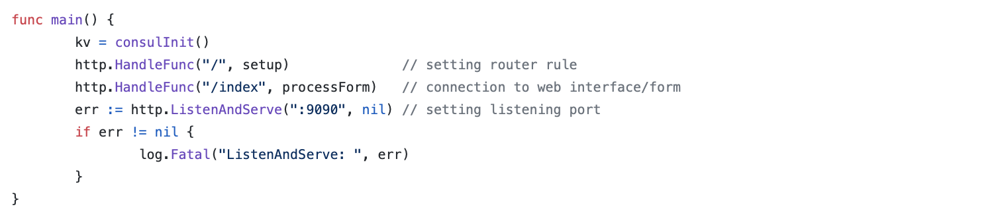
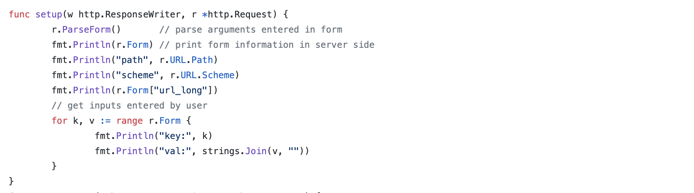
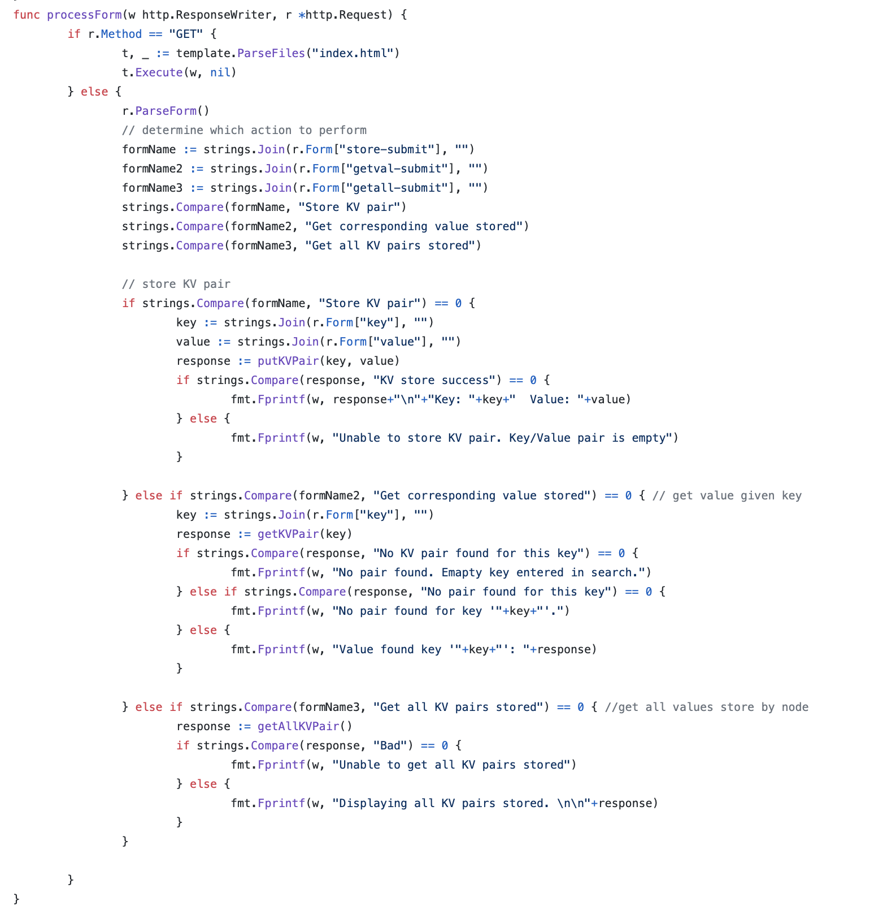
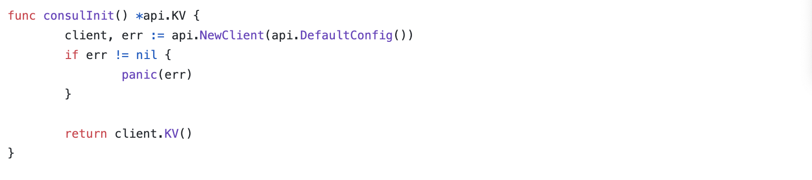
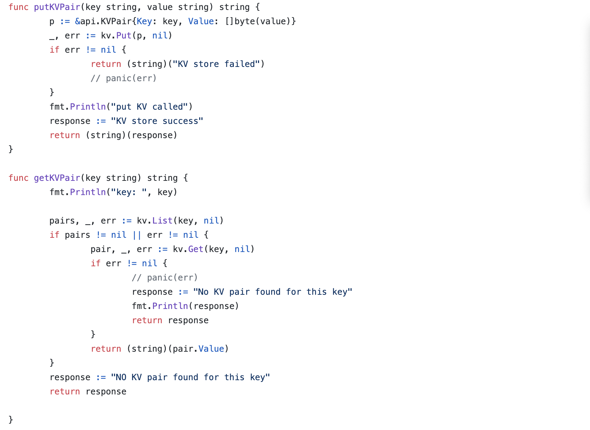

*by:* Katie Bramlett, Sreya Nalla, and Linnea Dierksheide

### Exploring Consul: Building a Web Interface for Key-Value Store

We offer an explanation of distributed consensus, what Consul can do, and a step-by-step tutorial for building a simple Web interface for a key value store using Consul.

---

### Distributed Consensus & Raft
For a system with just one node, making updates is simple. The client can just send the change directly to that node and if they get a success response from the system, the client can be confident that their change was made. However, if we have a *distributed* system, meaning that there are many nodes that should be working together and have the same information, making updates across the entire system becomes a lot more difficult. If we just send one request to a single nodes, how can we ensure that all nodes will get the update? What if nodes get updates in different orders? What we want is a way for all the nodes to come to a clear *consensus* on the state of the system. We would also want the system we use to provide strong consistency, fault tolerance, and liveness.


**Raft** is one broadly used distributed consensus algorithm, and it is the one that drives Consul. Each node is a follower, a candidate, or a leader. The leader node receives all requests and sends the updates to the followers (the rest of the nodes), all of which keep a replicated log of all the changes to the system. Once a majority of nodes let the leader know they've logged the request, it becomes committed. The leader also sends "heartbeats" every so often to the nodes. A node becomes a candidate if it stops receiving heartbeats from the leader (as this would mean the leader failed in some form). This will trigger an election, and the candidate votes for itself and sends a vote request to all other nodes, which will vote for it if it its log isn't "behind" theirs. Once it receives a majority of votes, the candidate becomes the new leader and the process continues. Though this is a quick summary of Raft, it is simple to understand and implement, a key benefit over other consensus algorithms like Paxos.

---

### What is Consul?
**Consul** is a multi-cloud service networking platform to connect and secure services across any runtime platform and public or private cloud. It is distributed, which means that it runs as a cluster of systems. This is significant as there can be no single point of failure. We will be focusing on the KV store feature of Consul. Consul KV is a core feature of Consul that allows users to store indexed objects as key-value pairs. Using the Raft Consensus Algorithm, it ensures that the data is consistent across all connected agents (both clients and servers). With Consul KV, users can add, delete, modify, and query data from the KV store.<br>
*Some of Consul's additional features are:*
- fully featured service-mesh control plane
- service discovery
- health checking
- secure service communication
- multi datacenter. <br> 

--- 

### Step-by-Step Tutorial
In this tutorial, we will walk you through installing Consul and setting up a simple web interface using the Consul API for Go. It requires that you already have Go installed on your machine. If you do not have Go installed, please follow the steps outlined [here.](https://golang.org/doc/install) The web interface allows you to store and retrieve key-value pairs. Here is a preview of the web interface that we designed:<br>

#### Setting Up Consul:
1. Install Consul
Mac OS X users may run `brew install consul`.
All others may manually download it [here](https://www.consul.io/downloads.html).
*Verify Installation:*
After installing Consul, verify that the installation worked by opening a new terminal session and running the command `consul`.<br>
2. Now, open up two command line terminals. In the first terminal, you can start your Consul Agent (aka node) by running `consul agent -dev`.
3. In the second terminal, run the command `consul members` to verify that you are an active node.
4. In the second terminal, you can end your Consul connection by running `consul leave`.<br>This will remove all key-value pairs that you've stored.
#### Creating The Web Interface:
First, start by making the front-end html code. We have created a simple form with three different actions -- storing key-value pairs, getting a single key-value pair, and getting all key-value pairs.To access the source code for this form, click [here](./code/index.html). Seen below is a snippet of the form that we have created.
```
	<div class="container">
    <h4>Store or Get Key/Value Pairs</h4>
    	<form action="" method="post">
      	<input type="text" name="key" required>
        <input type="text" name="value" required>
        <input type="submit" name="store-submit" value="Store KV pair">
      </form>
      <br>
      <form action="" method="post">
      	<input type="text" name="key">
        <input type="submit" name="getval-submit" value="Get corresponding value stored">
      </form>
      <br>
      <form action="" method="post">
      	<input type="submit" name="getall-submit" value="Get all KV pairs stored">
      </form>
	</div>
```
Once we have the form set up, we will build the web server for this form using Go. Go provides full HTTP support with the `net/http` package. Using this package, setting up a web server is simple becuase it allows us to parse the inputs entered into the HTML form using `parseForm()`. We will set up the web server to run on our local host machine on Port 9090. Upon submitting a request on this form, the request will be sent to the web server. Once we know which button has been pressed, then we can make the associated call from the Consul KV API. In the screenshots below, we will walk you through some of the main functions of our code. To view the full source code, click [here](https://github.com/katiebramlett/gwAdvNet20.github.io/blob/master/wiki/ConsulWithGoBlog/code/main.go).
<ul id="slider">
    <li></li>
    <li></li>
    <li></li>
	<li></li>
	<li></li>
</ul>

Now, run the Consul Agent with `consul agent -dev`.
Then,  build and run the Go code with `go run ./main.go`.
You can access the form we have just built with the web server at [localhost:9090/index](localhost:9090/index).

**Libraries Used in Web Interface:**
- [Consul API for Go](https://github.com/hashicorp/consul/tree/master/api)
- `net/http` 
<br>
*We hope this provides you with more knowledge about storing and retrieving key-value pairs and how to interact with Consul KV using Go.*

### Sources Used:
"A Quick Introduction to Consul." *Scott's Weblog*, 06 Feb. 2015, [www.blog.scottlowe.org/2015/02/06/quick-intro-to-consul/](https://blog.scottlowe.org/2015/02/06/quick-intro-to-consul/). Accessed 10 May 2020.
"Consensus Protocol." *HashiCorp Consul*, [www.consul.io/docs/internals/consensus.html](https://www.consul.io/docs/internals/consensus.html). Accessed 10 May 2020.
"Consul KV." *HashiCorp Consul*, [www.consul.io/docs/agent/kv.html](https://www.consul.io/docs/agent/kv.html). Accessed 10 May 2020.
Consul's Go API GitHub Repository. [www.github.com/hashicorp/consul/tree/master/api](https://github.com/hashicorp/consul/tree/master/api)
"Raft Resources." *Adv. Networking and Distributed Systems*, [www.gwadvnet20.github.io/wiki/raft/](https://gwadvnet20.github.io/wiki/raft/). Accessed 10 May 2020.
"Store Data in Consul KV." *HashiCorp Consul*, [www.learn.hashicorp.com/consul/getting-started/kv](https://learn.hashicorp.com/consul/getting-started/kv). Accessed 10 May 2020.
"4.1 Process Form Inputs." *GitBook*, [www.astaxie.gitbooks.io/build-web-application-with-golang/en/04.1.html](https://astaxie.gitbooks.io/build-web-application-with-golang/en/04.1.html). Accessed 10 May 2020.
