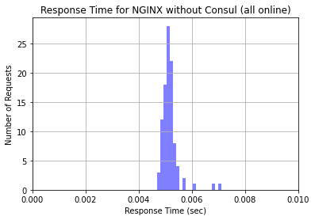
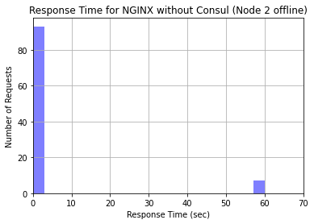
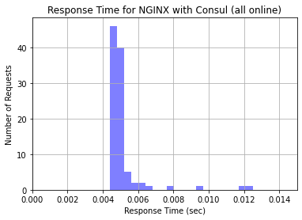
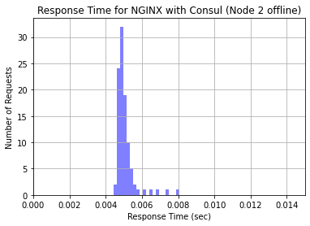

*by:* Ethan Baron and Catherine Meadows


## Analysis of NGINX Load Balancing performance compared to NGINX Load Balancing with Consul Template.

---


## Load Balancing 
Think about some of the most popular websites in today’s society and the amount of traffic that they receive at any given time. As of 2020, YouTube alone is estimated to receive over 1.5 billion visits per month<sup>1</sup>. In order to handle such high volumes of traffic, multiple servers are typically used to meet this demand in order to handle client requests concurrently. But what happens when a server goes down or a new server is added? And how do we make sure that all of the requests are not given to a single server? This is why we need *load balancing*.

Take a look at the diagram and notice how the load balancer distributes the client requests to multiple servers so that, even though multiple requests are being sent at the same time, they can all be handled efficiently rather than one at a time. 


Load balancing processes allow us to distribute network traffic and client requests across multiple servers, hence balancing the load of work to ensure that no server is bogged down by requests and to increase efficiency of the overall system. In addition to distributing the work evenly across servers, if a server goes down, a load balancer can halt sending requests to that server, increasing the reliability of the system. Likewise, if a new server is added, a load balancer can immediately begin directing traffic to it. Thus, load balancers make it easier to scale systems through the addition of resources. 

Depending on the system’s needs, load balancers use various different load balancing algorithms. Some common load balancing algorithms<sup>2</sup> include:
* “Round Robin” : Requests are directed to servers sequentially; This is the default algorithm for many load balancers and is a simple load balancing implementation but fails to account for the number of connections a server currently has.
* Server with the least number of connections : The request is directed to the server with the least number of current connections.
* IP Hash : A hash is performed on the client’s IP address to determine which server to distribute the request to. 

Load balancers can either be hardware or software. For a hardware-based load balancer, the load balancing software is loaded onto a specialized machine. While still effective, it can be expensive and can make scaling difficult. If traffic increases, more load balancing processors have to be bought, loaded with the load balancing software, and installed to handle the higher demand. Thus, software load balancers that run on commodity hardware are ideal for systems that need to be flexible in scaling.

## NGINX 

[NGINX](https://www.nginx.com) is an open source web server that offers, among other services, software-based load balancing. Many high-traffic websites like Netflix and Dropbox use NGINX/NGINX Plus to efficiently direct web traffic. NGINX uses the Round Robin method by default for load balancing but allows the user to specify another algorithm to accommodate the user’s needs. For more information on configuring NGINX, see [this link](https://upcloud.com/community/tutorials/configure-load-balancing-nginx/). 


## Consul
[Consul](https://www.consul.io) is a software service networking tool that offers a plethora of services, including dynamic load balancing. Consul offers [Consul Template](https://learn.hashicorp.com/consul/integrations/nginx-consul-template) which can be used in conjunction with NGINX to improve performance by performing health checks and automatically updating your NGINX configuration file. As you can see in the diagram below, when running a Consul client agent on the same instance as your NGINX load balancer, the Consul Template works in between the data center and the load balancer to update the NGINX load balancer configuration file to account for servers that are offline. By performing these health checks and auto updating the load balancer to direct traffic only to the healthy servers, it should enhance performance by eliminating the time that the NGINX load balancer would typically consume in waiting for a response from a server that is offline (NGINX typically waits about 60 seconds before determining that a server is offline).  


## Investigation 

#### Overview

For our investigation, we configured NGINX as a load balancer on an Amazon EC2 instance with three other EC2 instances to serve as application nodes. The NGINX load balancer instance was the only instance running NGINX as a web platform; the three nodes utilized Apache to deliver web content. Each of the instance nodes had the same identical index.html file which contained basic information about the node that the load balancer directed the traffic to. The basic information included the node identifier (1-3) and the IP address of the node. This information was hard-coded in to reduce reliance on scripts and libraries that could have variable speeds. The contents of each of the HTML files was relatively the same; below is the code used on the third EC2 instance.

```html
<!DOCTYPE HTML>
<html>

        <head>
                <title>Node 3</title>
        </head>
        <body>
                <h1>Node 3</h1>
                <p>You are connected to Node 3 with IP: 52.86.47.4</p>
        </body>

</html>
```


Pictured above is the NGINX load balancer configured using the least connections technique with all three of our EC2 instances online. Essentially, the load balancer compares the current number of connections that exist to each server and sends the incoming request to the server with the fewest connections<sup>3</sup>. This allowed us to ensure that each of the nodes received a relatively equal number of incoming connections.

To further our study, we also configured the Consul Template with the NGINX load balancer to test performance. After configuring the EC2 instances to be a Consul datacenter, we setup the main NGINX node to run a Consul Template, which scans a service called 'web' for online nodes and populates the NGINX load balancing configuration file with the set of available nodes. Consul determines which nodes to put in the file by checking whether the service is running on that node. The Consul service on each node communicates back to the leader the state of the node, which publishes that information to the rest of the nodes. This allows non-leader nodes to display the state of all nodes in the datacenter. We noticed this on the Consul UI page, where we could see all the nodes listed for the service and their health. For services, Consul conducts separate checks to determine if the specific server is online and healthy. An example of this is one of the nodes being online but not accepting connections on port 80 for HTTP requests. This would result in a positive result for the Node Check but a negative result for the Service Check. The Consul UI also shows the result of the Service Check: the basic HTML file that we uploaded onto each of the nodes. 

Once Consul has completed the Service Check, the Consul Template adds the service URL to the NGINX load balancer configuration file. This allows for dynamic updates to the load balancer depending on the health of the nodes and the Apache service. This is really cool, because it removes the need for NGINX to determine whether a node is online while handling requests; all nodes in the load balancer configuration will be online, so all requests will be sent to active nodes that pass the Service Check.

#### Script and Environment

Similarly to how we measured HTTP request time in lecture, we utilized [Jupyter](https://jupyter.org/) on an Amazon Cloud9 instance and the Python requests library to make 100 requests to the load balancing node to measure the access time when all nodes were online and when one node was taken offline. For information on installing Jupyter, see [this link](https://jupyter.org/install) and for information on configuring Cloud9, see [this link](https://docs.aws.amazon.com/cloud9/latest/user-guide/setting-up.html). 

To install the required packages, execute the following pip command:

```
# Use pip with current python version to install packages
python3 -m pip install -U jupyter numpy scipy pandas matplotlib seaborn
```

It is important to specify that we want to use python3 when calling pip because many distributions come with both Python 2 and Python 3. By running pip with Python 3, we can guarantee that the packages being installed are the most recent and are compatible with the version of Python that our scripts are utilizing.

Ensure that you have a port open on which you can run Jupyter. For this investigation, we opened and used port 8080 on Cloud9. After ensuring that you have a port available, run Jupyter on your Cloud9 instance by executing the following command in the console:

```bash
# run jupyter on port 8080
ipython3 notebook --ip=0.0.0.0 —port=8080 --no-browser
```

The script we used for the investigation is provided below:

```python
# Import required packages
import pandas as pd
import numpy as np
import matplotlib.pyplot as plt
import seaborn as sns
import requests
import time

# Set url for requests
data_url = 'url-goes-here'
# Create empty list for values
x = np.array([])
# Send 100 requests
for i in range(0, 100) :
    # Keep track of request start time
    start = time.time()
    # Make request to url
    r = requests.get(data_url)
    # Calculate amount of time elapsed in request
    elapsed = time.time() - start
    # Add new data point to list
    x = np.append(x, elapsed)
    # Pause for one second
    time.sleep(1)

# Define histogram variables
num_bins = 20
# Plot data on histogram
n, bins, patches = plt.hist(x, num_bins, facecolor='blue', alpha=0.5)
# Set axis labels and title
plt.ylabel('Number of Requests')
plt.xlabel('Response Time (sec)')
plt.title('Response Time for NGINX without Consul (all online)')
# Show grid on histogram
plt.grid(True)
# Set limit to remove outlier points; this varied based on the data we received
plt.xlim(0, 70)
# Display the histogram in Jupyter
plt.show()
```

#### Results

After running the Python script in Jupyter to generate requests to our NGINX load balancer, we generated a set of Histograms. The first histogram is the result of 100 requests sent to the load balancer while all three nodes were up and running. As is expected, the response time for a simple HTML file is extremely short. The histogram that was generated is pictured below.



Interestingly, but also expected, is the output from generating the second histogram, which had one of our EC2 instances offline. Notice that the scale of this histogram is vastly different. For approximately 10% of incoming requests, NGINX still attempted to direct traffic to the offline node. This resulted in an extremely long request time, because the load balancer continued to wait for the request to receive a response for 60 seconds. The rest of the connections were sent to the online nodes. What's super interesting about this is that NGINX doesn't send a strict 33% of traffic to each node; they prioritize the nodes that have not received connections recently. Since the offline node took a long time to respond, it received less connections. However, the load balancer still waited for the offline node to respond each time. This made the request time for a significant number of requests unhealthily long. The histogram generated when we had one node offline is pictured below.



After taking one node offline, we enabled Consul on the web service nodes and the NGINX load balancer node. We also ran the Consul Template on the load balancer node to pull the list of healthy nodes in the service and put their addresses in the load balancer configuration file. We ran another analysis using the same script on the NGINX load balancer running the Consul Template with all nodes online. The respective histogram is pictured below. Notice that the response times are comparable to the NGINX load balancer without Consul when all nodes were online.



The last test we did was the major test of the investigation: taking a node offline while keeping Consul Template on the load balancer to see if requests were faster. As mentioned before, Consul keeps a running track of which nodes are both online and passing the Service Check. Accordingly, when we took a node offline, Consul immediately noticed the Node Check failed and removed it from the NGINX load balancer configuration file. This effectively stops traffic from being sent to that node as soon as Consul detects it going offline. We sent another 100 requests to the load balancer with the node offline and generated a histogram with the resulting request times.



#### Conclusion
As clearly shown in the generated histograms, the Consul Template was successful in enhancing the performance of the NGINX load balancer in regard to handling server crashes. When a node was taken offline while the Consul Template was running on the same instance as the NGINX laod balancer, performance was significantly increased in comparison to the performance of the NGINX load balancer by itself. By performing checks and updating the NGINX configuration file to only distribute requests to healthy servers, the Consul Template offers an effective and compatible performance enhancing service for NGINX-a load balancing software solution that high-profile, high-traffic websites use today. 

---
Footnotes
1) https://ahrefs.com/blog/most-visited-websites/
2) https://www.nginx.com/resources/glossary/load-balancing/
3) https://www.nginx.com/blog/choosing-nginx-plus-load-balancing-techniques/
