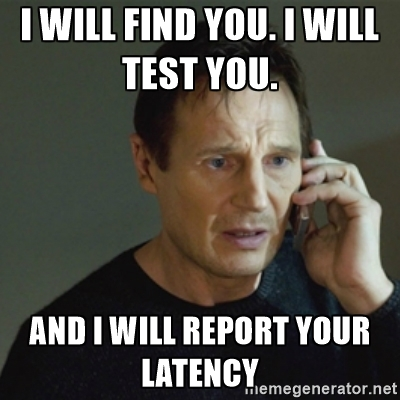
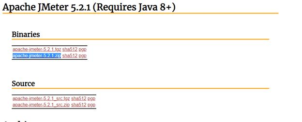
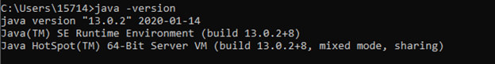
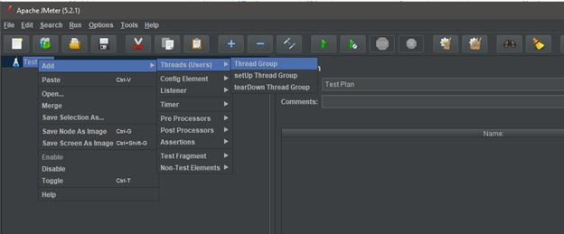
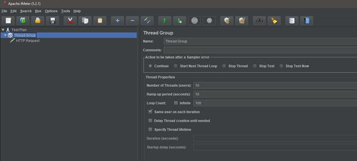
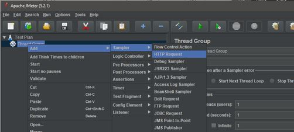
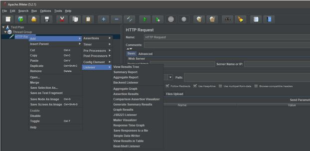
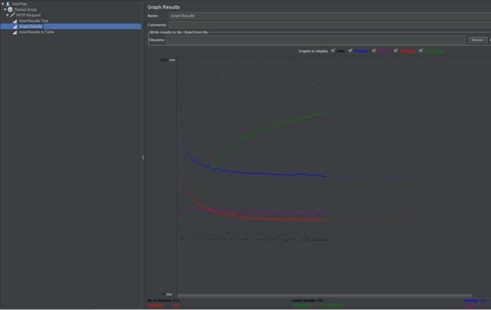

*by:* James Levy, Hamid Reza, and Samuel Farid

Hi, thanks for visiting our blog today. Some time ago during my networking class, we were talking about the performance and metrics of servers. This led into a conversation about what causes metrics to change in these systems. One of the things this made me think about was stress testing, in other words, seeing how your product reacts when put under extreme situations. Today we’ll be talking about what stress testing on your serve is and why it should happen. We will also take a look at how to use a stress testing tool called Jmeter.

#### Table of Contents

* [What is Stress Testing?](#introduction)
* [Jmeter](#jmeter)
* [Our Jmeter Example: (Sending Requests to Your Server and Measure Results)](#example)
* [Sources](#sources)

---

## What is Stress Testing? 
Stress testing is the process of putting your own software through extreme situations in order to see what will happen. It is often used in order to see what will cause your system to break. Some would say that the goal of stress testing is to break your product so that you can learn how to improve it. How is this different from load testing? Load testing doesn’t try to break your break your code, merely measure how the system performs. While load testing may be more common during the day to day experience, stress testing is still incredibly useful for product improvement in the long term.

There are  many different kinds of stress testing and each of them has their own specific use case. Knowing the different kinds, lets us come up with specific tests for the problems we want to solve, aiding us in solving our server issues quickly and efficiently. They also help us make sure that we have tested all the different elements without forgetting any. Here are some examples of the most common types of stress tests for servers.
* <b>Application Stress Testing:</b> This kind of testing focuses on the product itself. We use it to see if there are any performance bottlenecks, network issues, or problems with data management. 
* **Transactional Stress Testing:** This kind of testing checks to see how different parts of the system are interacting together. For example, how is the server interacting with the main database?
* **Systemic Stress Testing:** This type of stress testing checks on the multiple systems that run within the same server. 
* **Exploratory Stress Testing:** This type of stress testing is the kind that may sound the most familiar. It looks at unusual scenarios that could occur. Some of these situations you may look at include, an extreme amount of clients connected at the same time or when a large amount of data is transferred to your server all at once. 

Today we will be focusing on focusing on the Application and Exploratory stress testing in the exercise to come. 

<u>Now that we know what stress testing is, why should we care?</u>

Quality! Quality! Quality! We want to provide the best service possible to our users. This means that we need to include stress testing in the set of tests we run on our server. For example, when the Affordable Care Act’s website first launched, it was flooded with people trying to reach it, causing the server to go down for a period of time. This is an example where increased stress testing on the number of concurrent users would have helped the service. Another example, is that in order to make sure that their services work during high sales periods like Christmas, Amazon does stress testing to make sure their latency and speeds are consistent. By getting data like latency reports, connections before overload, and network efficiency, we can learn to improve the product. 

A broken product/server is not only bad for the customers, but also the developer’s reputation.

## Jmeter 

Jmeter is a Java based load and stress testing tool. It allows the user to play with many different functionalities such as sending requests to a server and seeing how a server reacts to a set of inputs. Jmeter could be downloaded form [here]( https://jmeter.apache.org/download_jmeter.cgi). You should download and extract the binary zip file.

It is worth noting that Jmeter requires a Java JDK of at least 8. You can verify which version of java you have installed by running this command in the windows command prompt or linux/mac terminal: *Java -version.*

In order to run Jmeter, go to the extracted directory,  then go to the /bin  folder and run jmeter.bat file.

## Our Jmeter Example: (Sending Requests to Your Server and Measure Results)
Now that we have Jmeter installed and running, We are going to go over a simple example that can connect to a web server and send it a number of HTTP requests. This example should give you a good idea of what can be done with Jmeter. Furthermore, by tweaking different elements of this default test you can edit your stress test to be more or less intense. This will allow you to create your own set of tests that differ in intensity. It’s the first step in creating your own personalized server testing suite.

<u>Step 1: Create a “Test Plan”</u>

When we open the program there is a test plan already created automatically. This is where we will be working on creating our test case. Think of it like the “project” in your IDE. Even though opening Jmeter will create a test automatically, we can always load or create other tests.

<u>Step 2: Create a “Thread Group”</u>

Right click on the Test Plan → Add → Threads (Users) → Thread Group

Left clicking the Thread Group will open its window/pane. The thread group controls the number of connections that Jmeter will use and how those connections will operate. In the thread group, you can specify the number of threads/users. Higher numbers will create more connections and create heavier tests on your server. You can also set ramp up times, which control how fast those connections will be made, allowing you to test elements such as server caching. Do you want all your connections to flood in as fast as possible or slowly over time? Lastly, the total number of iterations for your test can be controlled by loop count. In our example, we use the parameters of 10, 10, and 100. 

<u>Step 3: Create an “HTTP Request”</u>

Right click on the Thread Group → Add → Sampler → HTTP Request

This HTTP Request will imitate what the browser is doing and will allow you to connect to the server you are testing. Once you click this option and get its menu, you will see that this is where you specify the host that you want to connect to via IP and path. It is worth noting that Jmeter also supports plenty of other request types so that you are not limited to HTTP. 

<u>Step 4: Add “View Results Tree”, “View Results in Table” and “Graph Results” Listener</u>

Right click on the HTTP Request → Add → Listener →

These listeners are graphs and charts to visualize the results that are generated by our test. You are able to set multiple listeners per test/thread group. This is useful as it allows you to analyze your data in various ways. In our example, lets go ahead and add the options to graph our results, view them as a tree, as well as view our results from a table. 

<u>Step 5: Save Project, Start</u>

You can save the project via the file menu and start it by hitting the green button. This will send requests to the web server and generate different types of results. 

If we focus on the graph portion of our example, we can see that not only do our results show up in real time, but that there are also multiple graphs that we can use to see what is happening. This includes elements such as deviations (which can be good or bad), average and median latencies (which can help determine performance), and throughput. Learning how to interpret the graphs will also be a useful skill in determining what changes you want to make to your server. Likewise, added information can also be found from the other listeners we provided. 

## Sources: 

We thank you for reading our blogpost and we hope that you learned something new today. Our blogpost has used a couple of different sources to help explain our concepts. If you want to learn even more, we highly suggest you visit these sites.
* https://www.youtube.com/watch?v=DGW1Yk-Z7tI
* https://www.guru99.com/stress-testing-tutorial.html
* https://www.guru99.com/jmeter-tutorials.html

