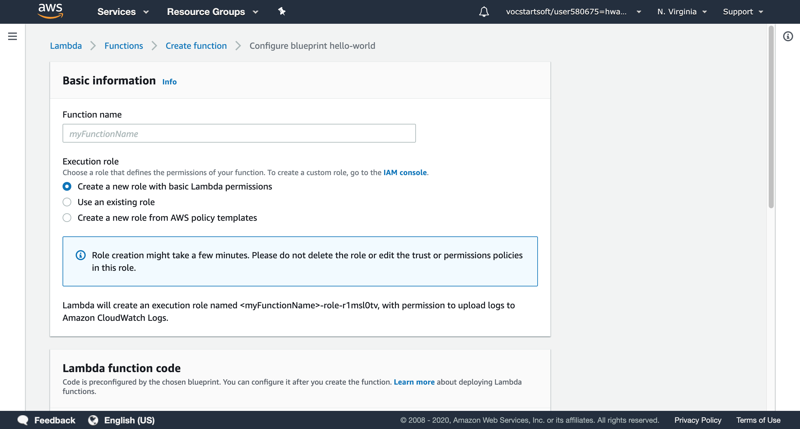
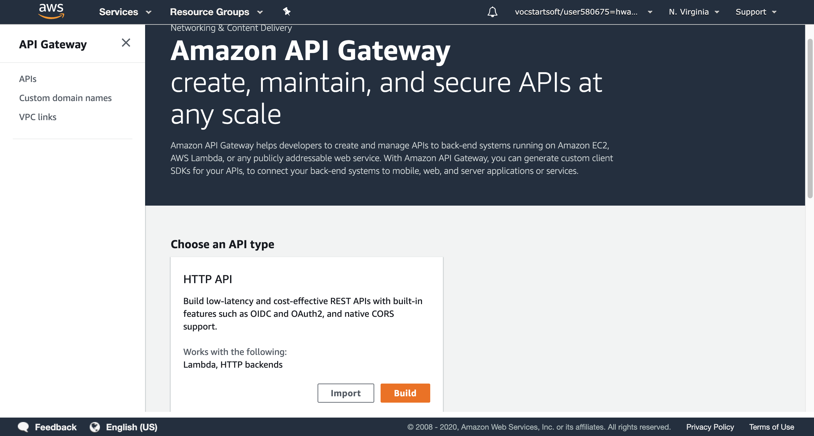
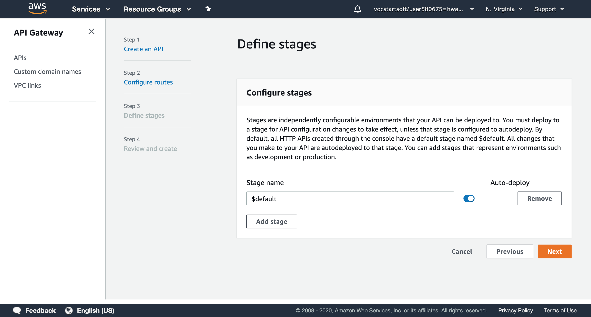
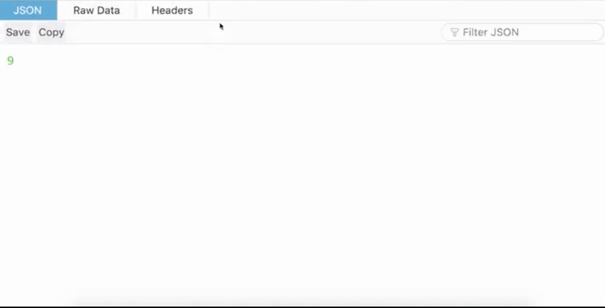

*by:* Henian Wang

In this article, I used Amazon API gateway with a AWS lambda function.

---


"Serverless" architecture is an important area of cloud computing, and is getting more attention from the industry. The idea behind 'serverless' is that users don't manage provisioning, scaling, or maintenance of the physical machines that host their application code. AWS services, as a pioneer in "Serverless" area, provide relative services for users: AWS lambda, AWS API Gateway, AWS Batch, and AWS DynamoDB. In this article, a simple instance that combined AWS lambda with AWS API gateway will be introduced as a startup of "serverless" architecture. In this case, an API that generate random number will route HTTP requests to a lambda function.

## 1. Create a AWS Lambda Function

AWS lambda is AWS' serverless compute offering as a part of AWS services. It allows users to define Lambda functions in a selection of runtimes that can be invoked via a variety of triggers, including SNS notifications and API Gateway invocations. The [AWS lambda](https://aws.amazon.com/lambda/) requires AWS service account, or you can sign with AWS educate account:


AWS lambda provides three types of functions to create: Author from scratch, blue print, and Browse serverless app repository. Using a blue print to create a Lambda application is useful and convinient for common uses, or you can build a Lambda application from scratch, which needs writing codes and configuration written by yourself. In this case, I create a simple hello-world node.js function.


Before creating a lambda function, some basic information like function name and execution role is required. If this is the first time you use AWS lambda, you may choose 'Create a new role with basic Lambda permissions'. Then click the 'Create Function'.



## 2. Manage & Test the Function

In function list, we can find all the lambda functions that we created. For every function, AWS lambda provides management tools. In designer module, we can add trigger or destination for the lambda function, which we will mention in later part.


The function code module allows users modify codes. Users can edit code by the given ide, or upload files from local PC. The 'Runtime' gives a list of all programming languages that AWS lambda supports now. Based on the hello-world blue print that the platform provided, I modified to a simple program for testing.


To be more convinient, you can add environment variables, which store configuration settings without the need to change function code. Tags are labels of functions for searching and tracking costs.


Basic settings contains the memory you assigned to this function, the running timeout, and the description of the function. You can modify settings at any time. If you have virtual private cloud (VPC), the lambda functions can be connected to it. Many companies or schools may use their VPCs to store lambda functions for security. If you wants to reduce the latency of running functions, concurrency will be a useful option: but it will be priced separately. 


asynchronous configuration allows users to decide how long the function will exist in the unprocessed queue and how many times the function will retry when it returns an error. To store the return value, you can create a database proxy that connect your function to a database. In serverless architecture, AWS DynamoDB is the destination that can scan, edit, and delete the item.


After finishing all the settings and configurations (you can change at any time), you can test your function. In my cases, the test report will be like:


My program (named index.js) successfully generate a random number, but the more valuable things in the log is the summary. You can see the duration and billed duration, which matters how much you pay for a function. 128 MB is the assigned memory for the function, and it used 62 MB of 128 MB. It shows the runtime and space complexity of the algorithm that your function uses. If the test failed, the Log output would give the logging calls that point out errors.


## 3. Create an API by Amazon API Gateway

API Gateway provides a scalable, secured front-end for service APIs, and can work with Lambda, Elastic Beanstalk, or regular EC2 services. It allows “serverless” deployment of applications built with Lambda. To create an API by Amazon API gateway, you could search it from amazon services, or enter the [homepage](https://aws.amazon.com/api-gateway/). After signing in, the page shows there will be 4 steps for creating an API: Create an API, Configuration routes, Define stages, and Review and Create. 

Amazon API gateway provides two types of API: RESTful API and Websocket API. RESTful API is a common choice for serverless workloads and HTTP backends using HTTP APIs. Websocket API is useful when you want to build a real-time two-way communication applications such as chat apps. In our case, we choose the most common one: HTTP API.



The first step is determine the backend services that API connects with, or integrations. You can choose either Lambda or HTTP integration. 

```
  Integration type          Invokes                    Response
- Lambda integration  the Lambda function   the response from the function.
- HTTP integration           URL            the response from the URL
```

Basically, you can add more than one integrations for an API. In our case, we directly use the lambda function that we created before, and named the API as 'RandomGenerator'. AWS region should be the nearest location geographically to reduce the latency. 


API Gateway uses routes to expose integrations to consumers of your API. Routes for HTTP APIs consist of two parts: an HTTP method and a resource path (e.g., GET /pets). You can define specific HTTP methods for your integration (GET, POST, PUT, PATCH, HEAD, OPTIONS, and DELETE) or use the ANY method to match all methods that you haven't defined on a given resource.

The next step is the configure routes that expose integrations. For HTTP API, it allows you to use an HTTP method (GET, POST, PUT, HEAD, etc) for the lambda function. To retrieve the random number, I will use simple GET function and set the source path as GET /index. 


The third step is defining a stage for your API. Stages are somewhere your API will be deployed. For example, a test version of your API could be deployed to a stage named beta. You can mamange stages to control versions of different APIs. By default, all HTTP APIs have a named $default, or you can add more stages to represent environments such as development or productions. 



The last step is to review what API you want to create. You can edit the configurations through the last page. If all things are good, you can click 'create' to create your own API.


## 4. Test the API with lambda function

A successfully notification is always exciting for developers. For our simple random number generator, we can edit and find all stages information of our API. 


We can verify our output by using the 'invoke url': https://8ry5iatxta.execute-api.us-east-1.amazonaws.com. The page shows a random number, and it will be a new number after refreshing the page. The result is corresponding with the lambda function that we created before. 




## What did I learn?
In this project, I used AWS lambda function with an Amazon API gateway. I created a simple random number generator lambda function and integrated it by an new API. The invokes url returns the correct random number. By combining the two AWS services, I learned some basic knowledge about AWS lambda and Amazon API gateway. In future work, I will keep exploring the serverless architecture by AWS lambda and API gateway, and finding more interesting AWS servcies.


## Reference
1. https://docs.aws.amazon.com/lambda/latest/dg/services-apigateway-tutorial.html
2. https://github.com/open-guides/og-aws
