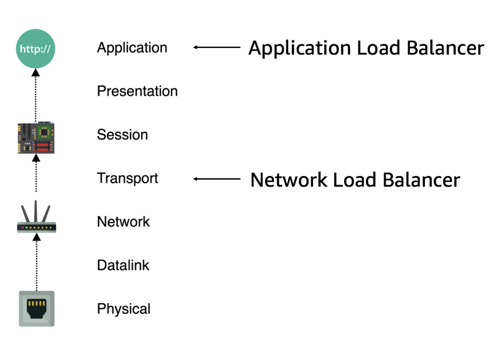
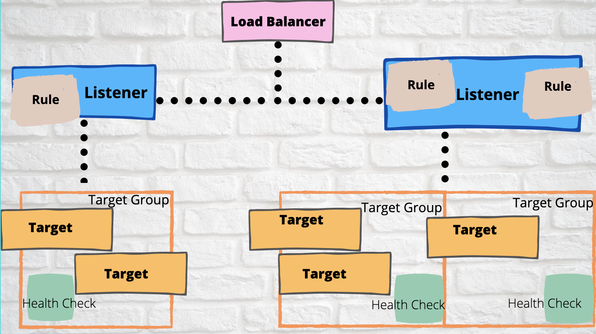
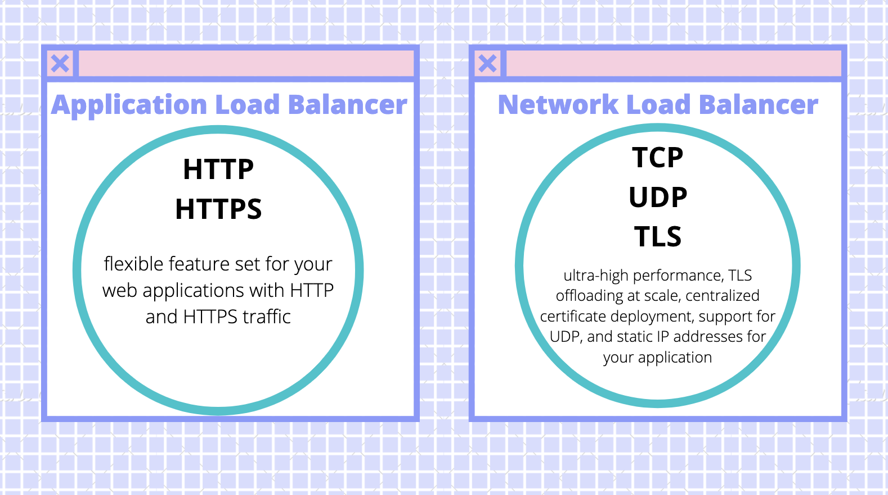
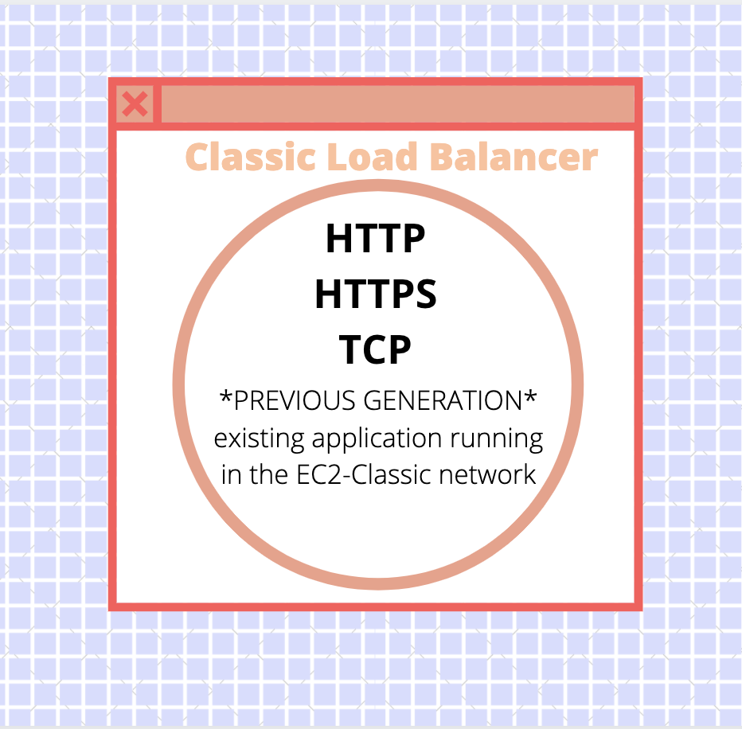
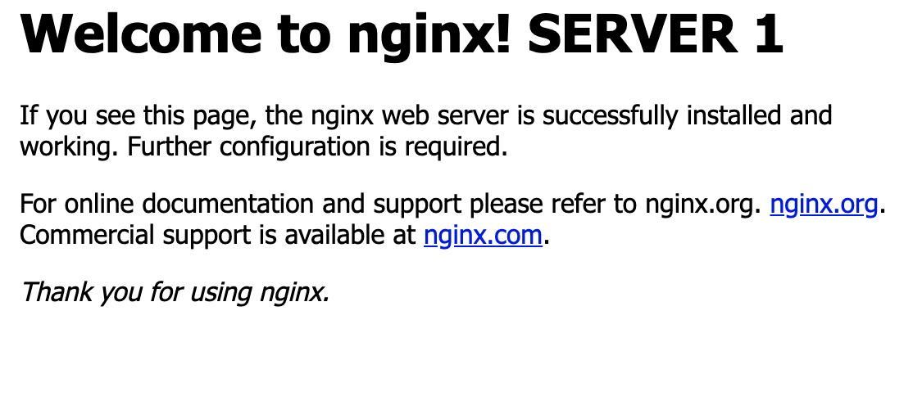
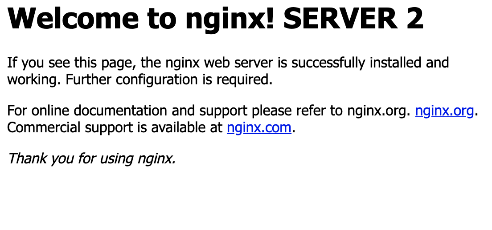
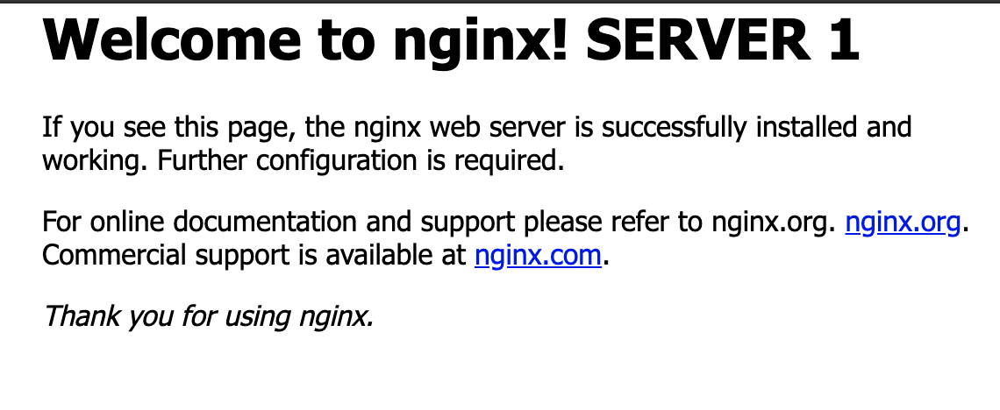
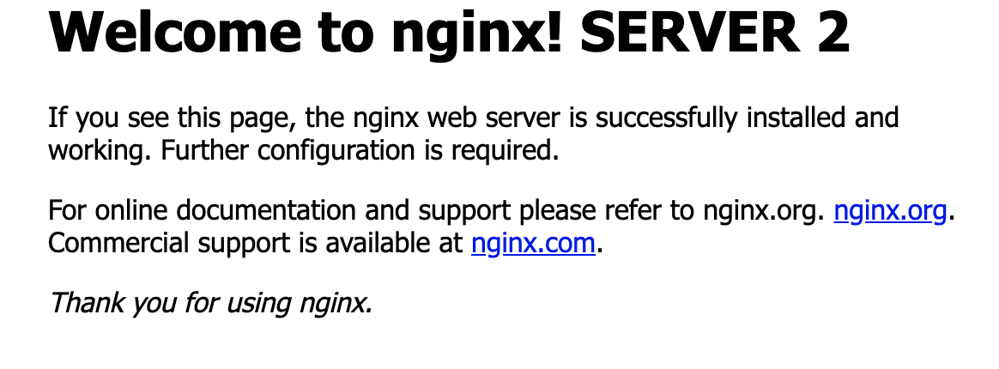

*by:* Tuhina Dasgupta

AWS has 3 elastic load balancers that are going to be evaluated in combination with an EC2 instance. 

This blog post will begin with defining the needed vocabulary and providing an introduction, then discuss each set up, and finish with an evaluation of each load balancer w/EC2.

---
## Key Definitions
- Load Balancer: routes incoming traffic to its targets (like EC2 instances) in an Availability zone. It also monitors the health of its registered targets and ensures that it routes traffic only to healthy targets. When the load balancer detects an unhealthy target, it stops routing traffic to that target; it then resumes routing traffic to that target when it detects that the target is healthy again.
- Availability Zone: are distinct locations within an AWS Region that are isolated from failures in other Availability Zones; they provide inexpensive, low-latency network connectivity to other Availability Zones in the same AWS Region, each of which are independent. 
- Elastic Compute Cloud: allows users to rent virtual computers on which to run their own computer applications. EC2 encourages scalable deployment of applications by providing a web service through which a user can boot an Amazon Machine Image to configure a virtual machine, called an instance, containing any software desired. A user can pay by the second for active servers – hence the term elastic.
- Application Load Balancer: functions at the application layer, the seventh layer of the Open Systems Interconnection (OSI) model. After the load balancer receives a request, it evaluates the listener rules in priority order to determine which rule to apply, and then selects a target from the target group for the rule action. 
- Network Load Balancer: functions at the 4th layer of the Open Systems Interconnection (OSI) model. After the load balancer receives a connection request, it selects a target from the target group for the default rule. It attempts to open a TCP connection to the selected target on the port specified in the listener configuration. 
- Classic Load Balancer: operates at Layer 4 of the OSI model. This means that the load balancer routes traffic between clients and backend servers based on IP address and TCP port. In the default configuration, the Classic Load Balancer will route traffic evenly between Availability Zones (AZ) that are enabled in the ELB.
- Virtual Private Cloud (VPC): an on-demand configurable pool of shared computing resources allocated within a public cloud environment, providing a certain level of isolation between the different organizations using the resources.
*source: AWS Documentation 

## Introduction  
### All About Load Balancers 
 

The load balancers sit between the client and servers and help spread the traffic across servers to improve responsiveness and availability of applications, websites or databases.
Load balancers play a vital role in any organization where server uptime, client and staff connectivity, and performance are considered essential.

General Benfits: 
  - Reduced Downtime
  - Scalable
  - Redundancy
  - Flexibility
  - Efficiency

OSI Model w/LB 
 
*Classic LB has features of both Layer 4 & 7*

Specific Benefits: 
  - L4 (Network/Classic LB) — directs traffic based on data from network and transport layer protocols, such as IP address and TCP port.
  - L7 (Application/Classic LB)— adds content switching to load balancing, allowing routing decisions based on attributes like HTTP header, uniform resource identifier, SSL session ID and HTML form data.
  - GSLB — Global Server Load Balancing extends L4 and L7 capabilities to servers in different geographic locations.

For a detailed comparision of different features of each LB view this attachment (based off AWS Documentation):
<a href="table.pdf"> Link </a>
 
AWS specific basic load balancer illustration:  
 

Breakdown: 
  - Target: Targets are the resources to be invoked when a rule is triggered.
  - Target group: register your targets with a target group overriding the default values. 
  - Listener: a process that checks for connection requests, using the protocol and port that you configure. The rules that you define for a listener determine how the load balancer routes requests to its registered targets.
  - Rule: Each rule consists of a priority, one or more actions, and one or more conditions. 
  - Health check: LB periodically sends requests to its registered targets to test their status (health checks)

## Setup Tutorials
### Application LB & Network LB
 

<b>Steps</b>  
*The steps are essentially the same just substitute either Application or Network for y/n*
1. Open a new EC2 instance and select the add y/n load balancer option 
2. Configure the name, scheme & IP address type (default), listener (default), and availabilty zone (same one used for EC2)
3. Create a new security group and set a name and description 
4. Configure the target group by keeping the default (New target group), setting a name, keeping ddefault target type (Instance), protocol (HTTP), and port (80); also keep the default settings for health checks 
5. Register instances w/target group; For Instances, select one or more instances, keep the default port (80) and choose Add to registered
6. Review the settings that you selected. 
7. Verify that it's sending traffic to your EC2 instances by checking Load Balancing -> Target Groups tab

 

### Classic LB
 

<b>Steps</b>
1. Open a new EC2-Classic instance and select the add load balancer option
2. Select the Classic Load Balancer option 
3. Set a name for the LB and leave the default configuration for the listener
4. Configure the health checks by leaving Ping Protocol set to HTTP, Ping Port set to 80, and Ping Path set to a single forward slash ("/")
5. Select the EC2 instances to register with the Load Balancer
6. Review the selected settings and click the create button 
7. Verify that it's sending traffic to your EC2 instances by viewing the Description -> Status tab 

 
## Example 
Instance Setup: EC2 instance (t2.micro) Amazon Linux 2 AMI 

### Experiment 1 - ALB
Diagram:  
 

install on EC2 shell: httpd
Load Balancer Setup: mostly default settings -> important to register target as the EC2 instances
Wait ~5 min for load balancer to configure
EC2 instances each have an index.html 

Navigate to the DNS for the LB and each index.html page will display on refresh. 

Server/Instance 1 displays:  
 

Server/Instance 2 displays:  
 

### Experiment 2 - NLB
Nginx:  
 
(open source web server)

install on EC2 shell: ufw, nginx
Load Balancer Setup: mostly default settings -> important to register target as the EC2 instances & same VPC as instances
Wait ~5 min for load balancer to configure

Navigate to the DNS for the LB and each nginx welcome page will display on refresh. 

Server 1 displays:  
 

Server 2 displays:  
 

### Experiment 3 - CLB
Since CLB can handle both TCP and HTTP traffic, I tried both of the above examples with a CLB. 
*obervation: much fewer options in general from protocols to supported EC2 images*
ALB Experiment: 
Load Balancer Setup: same settings as ALB (ie. Ping Path)
Navigate to the DNS for the LB and each index.html page will display on refresh. 

Server 1 displays:  
 

Server 2 displays:  
 

NLB Experiment: 
Load Balancer Setup: same settings as NLB
Navigate to the DNS for the LB and each nginx welcome page will display on refresh. 

Server 1 displays:  
 

Server 2 displays:  
 

side note: migration from CLassic to ALB/NLB was super easy with the mogration wizards (nice job AWS!)

## Analysis 
### Application LB
ALB works on a Layer 7 OSI model and allows traffic distribution toward backend instances based on the information inside the HTTP requests header. With ALB, the connection is terminated at the ALB, and there are connection pools toward the backend instances.

Key CloudWatch Metrics: 
  - HealthyHost Count: shows the number of healthy instances in each Availability Zone.
  - Latency: measures the elapsed time (in seconds) from the moment of the request being forwarded to the backend section, to the moment of the response from the backend section.
  - Rejected Connection Count: because ALB doesn’t use surge queues like the Classic Load Balancer, it’s important to pay attention to this metric. This is the number of connections rejected because the load balancer couldn’t make a connection to the health target to route the request.
  - Access logs: For ALB, access logs are generated every five minutes and stored to S3. You will have to pay S3 expenses but you won’t pay for the data transfer to the S3. Access logs are “eventually consistent,” which means that the files can be produced out of order. AWS does not guarantee that every request will be written to the access logs. 

Benefits: 
  - Support for path-based routing; enables you to structure your application as smaller services, and route requests to the correct service based on the content of the URL.
  - Support for host-based routing; enables you to route requests to multiple domains using a single load balancer.
  - Support for routing based on fields in the request, such as standard and custom HTTP headers and methods, query parameters, and source IP addresses.
  - Support for routing requests to multiple applications on a single EC2 instance. You can register each instance or IP address with the same target group using multiple ports.
  - Support for redirecting requests from one URL to another.
  - Support for returning a custom HTTP response.
  - Support for registering targets by IP address, including targets outside the VPC for the load balancer.
  - Support for registering Lambda functions as targets.
  - Support for the load balancer to authenticate users of your applications through their corporate or social identities before routing requests.
  - Support for containerized applications. Amazon Elastic Container Service (Amazon ECS) can select an unused port when scheduling a task and register the task with a target group using this port. This enables you to make efficient use of your clusters.
  - Support for monitoring the health of each service independently, as health checks are defined at the target group level and many CloudWatch metrics are reported at the target group level.
  - Access logs contain additional information and are stored in compressed format.
  - Improved load balancer performance.

### Network LB
A Network Load Balancer functions at the fourth layer of the Open Systems Interconnection (OSI) model; it can handle millions of requests per second. After the load balancer receives a connection request, it selects a target from the target group for the default rule. It attempts to open a TCP connection to the selected target on the port specified in the listener configuration.

Key CloudWatch Metrics: 
  - HealthyHost Count: shows the number of healthy instances in each Availability Zone.
  - ActiveFlow Count: the total number of concurrent flows (or connections) from clients to targets.
  - TCP Client Reset Count: the total number of reset (RST) packets sent from a client to a target. 
  - TCP ELB Reset Count: the total number of reset (RST) packets generated by the load balancer.
  - TCP Target Reset Count: the total number of reset (RST) packets sent from a target to a client. 

Benefits: 
  - Ability to handle volatile workloads and scale to millions of requests per second.
  - Support for static IP addresses for the load balancer. You can also assign one Elastic IP address per subnet enabled for the load balancer.
  - Support for registering targets by IP address, including targets outside the VPC for the load balancer.
  - Support for routing requests to multiple applications on a single EC2 instance. You can register each instance or IP address with the same target group using multiple ports.
  - Support for containerized applications. Amazon Elastic Container Service (Amazon ECS) can select an unused port when scheduling a task and register the task with a target group using this port. This enables you to make efficient use of your clusters.
  - Support for monitoring the health of each service independently, as health checks are defined at the target group level and many Amazon CloudWatch metrics are reported at the target group level. Attaching a target group to an Auto Scaling group enables you to scale each service dynamically based on demand.
  
### Classic LB
The Classic Load Balancer is a connection-based balancer where requests are forwarded by the load balancer without “looking into” any of these requests; they just get forwarded to the backend section.

Key CloudWatch Metrics: 
  - RequestCount: This metric measures the amount of traffic your load balancer is handling. Keeping an eye on peaks and drops allows you to alert on drastic changes which might indicate a problem with AWS or upstream issues like DNS.
  - SurgeQueueLength: When your backend instances are fully loaded and can’t process any more requests, incoming requests are queued, which can increase latency (see below) leading to slow user navigation or timeout errors. That’s why this metric should remain as low as possible, ideally at zero.
  - SpilloverCount: When the SurgeQueueLength reaches the maximum of 1,024 queued requests, new requests are dropped, the user receives a 503 error, and the spillover count metric is incremented. In a healthy system, this metric is always equal to zero.
  - HTTPCode ELB 5XX: This metric counts the number of requests that could not be properly handled. It can have different root causes:
      - If the error code is 502 (Bad Gateway), the backend instance returned a response, but the load balancer couldn’t parse it because the load balancer was not working properly or the response was malformed.
     - If it’s 503 (Service Unavailable), the error comes from your backend instances or the load balancer, which may not have had enough capacity to handle the request.
     - If a 504 error (Gateway Timeout) is returned, the response time exceeded ELB’s idle timeout. 

Benefits: 
  - Support for EC2-Classic
  - Support for TCP and SSL listeners
  - Support for sticky sessions using application-generated cookies
  
## Conclusion
### When Which ?
Although most new implementations of load balancing do not include Classic Load Balancers, there are still reasons some need it. These include, per Amazon’s own CLB page, support for EC2-Classic, TCP and SSL listeners, and sticky sessions using application-generated cookies.
  --> Legacy 

Application Load Balancers are used for HTTP/HTTPS traffic and enable advanced routing, SSL/TLS termination, and visibility for microservices, containers, and other application architectures. ALB serves distributed architectures best; ALB allows for great flexibility but is not suitable for encrypted requests.
  
Network Load Balancers handle only TCP packets and cannot access the details of an HTTP request in the same way as ALB. However, if end-to-end encryption is required, then NLB is the best option as it  sends traffic—TCP packets—directly to the web server reducing latency and ensuring security from the client to the server; NLB is useful for applications that require fixed IP addresses and high-performance routing.

## Credits 
1. AWS documentation is stellar and many of the definitions and the set up steps come from me using it 
2. Canva for being the tool I used to make all the graphics (except the Nginx logo - Google/Wikipedia; and screenshots)
3. Application LB tutorial that worked after changing my vpc: https://www.edureka.co/blog/elastic-load-balancer-tutorial-application-load-balancer
