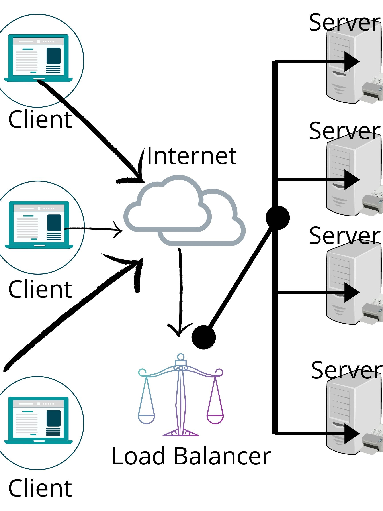

*by:* Tuhina Dasgupta

AWS has 3 elastic load balancers that are going to be evaluated in combination with an EC2 instance. 

This blog post will begin with defining the needed vocabulary and providing an introduction, then discuss each set up, and finish with an evaluation of each load balancer w/EC2.

---
## Key Definitions
- Load Balancer: routes incoming traffic to its targets (like EC2 instances) in an Availability zone. It also monitors the health of its registered targets and ensures that it routes traffic only to healthy targets. When the load balancer detects an unhealthy target, it stops routing traffic to that target; it then resumes routing traffic to that target when it detects that the target is healthy again.
- Availability Zone: are distinct locations within an AWS Region that are isolated from failures in other Availability Zones; they provide inexpensive, low-latency network connectivity to other Availability Zones in the same AWS Region, each of which are independent. 
- Elastic Compute Cloud: allows users to rent virtual computers on which to run their own computer applications. EC2 encourages scalable deployment of applications by providing a web service through which a user can boot an Amazon Machine Image to configure a virtual machine, called an instance, containing any software desired. A user can pay by the second for active servers – hence the term elastic.
- Application Load Balancer: functions at the application layer, the seventh layer of the Open Systems Interconnection (OSI) model. After the load balancer receives a request, it evaluates the listener rules in priority order to determine which rule to apply, and then selects a target from the target group for the rule action. 
- Network Load Balancer: functions at the 4th layer of the Open Systems Interconnection (OSI) model. After the load balancer receives a connection request, it selects a target from the target group for the default rule. It attempts to open a TCP connection to the selected target on the port specified in the listener configuration. 
- Classic Load Balancer: operates at Layer 4 of the OSI model. This means that the load balancer routes traffic between clients and backend servers based on IP address and TCP port. In the default configuration, the Classic Load Balancer will route traffic evenly between Availability Zones (AZ) that are enabled in the ELB.

*source: AWS Documentation 

## Introduction  
### All About Load Balancers 
flow of traffic & load balancer placement illustrated below: 

*created using Canva* 

The load balancers sit between the client and servers and help spread the traffic across servers to improve responsiveness and availability of applications, websites or databases.
Load balancers play a vital role in any organization where server uptime, client and staff connectivity, and performance are considered essential.

General Benfits: 
  - Reduced Downtime
  - Scalable
  - Redundancy
  - Flexibility
  - Efficiency
  
Specific Benefits: 
  - L4 (Network/Classic LB) — directs traffic based on data from network and transport layer protocols, such as IP address and TCP port.
  - L7 (Application LB)— adds content switching to load balancing, allowing routing decisions based on attributes like HTTP header, uniform resource identifier, SSL session ID and HTML form data.
  - GSLB — Global Server Load Balancing extends L4 and L7 capabilities to servers in different geographic locations.
  
### AWS X Load Balancer 

## Setup 
### Application LB

### Network LB

### Classic LB

## Evaluation 
