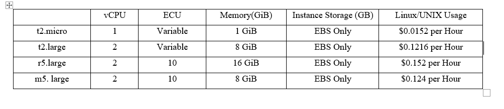

*by:* Samuel Farid and Hamid Reza

A short description of your post goes here.

---
# Creating an Environment and Deploying a Web Application with Elastic Beanstalk

In this experiment we will deploy a sample web application in amazon cloud servers by Elastic Beanstalk service. As Amazon explains: “AWS Elastic Beanstalk is an easy-to-use service for deploying and scaling web applications and services developed with Java, .NET, PHP, Node.js, Python, Ruby, Go, and Docker on familiar servers such as Apache, Nginx, Passenger, and IIS”.

The sample application contains a welcome webpage with couple of links to other resources. The mentioned web application is deployed on four different machine types: t2.micro, t2.large, r5.large and m5.large. Details for each of these instance types are available below (Table 1).

Table 1: Amazon EC2 Pricing.

For deploying a web application with Elastic Beanstalk, first we have to login to the AWS console. Then search Elastic Beanstalk and open launch the service (Screenshot 1).
 

Screenshot 1.

Then we must create an environment for our web application (Screenshot 2). In this section, we can configure our environment to test the application with different machine types.
 

Screenshot 2.

Here we should select “Web server environment” for deploying a web application (Screenshot 3).
 

Screenshot 3.

In the next section, we can choose a name and domain (Screenshot 4 and 5) for our environment. For changing “.us-east-2.elasticbeanstalk.com”, we can change our region  which will also effect the price of the instance that we will use.
 

Screenshot 4.

 

Screenshot 5.

In platform section we should choose the language and platform branch that we have used to develop our web application. Here we have chosen “Go” and the proper platform branch (Screenshot 6).
 

Screenshot 6.

For changing instance types, click on “Configure more options” and then we have to select “Edit” in Capacity box (Screenshot 7).
 

Screenshot 7.

Here, we can choose between different instance types (Screenshot 8).
 

Screenshot 8.

Then we save the configurations and create the environment (Screenshot 9). It will take about 10 minutes.
 

Screenshot 9.

Now we can upload and deploy our web application (Screenshot 10).
 

Screenshot 10.

# Distributed Load Testing on AWS

This AWS solution integrates various AWS services to simulate different workloads and determines your application’s behavior. That helps in identifying the bottlenecks before releasing the application. 

The following diagram shows the architecture of this solution:

