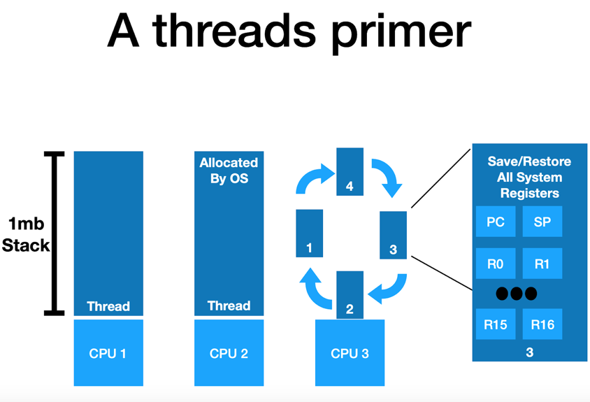
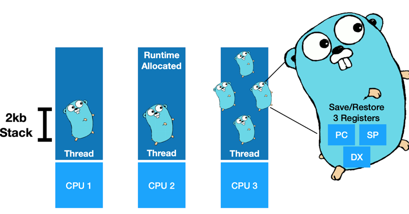
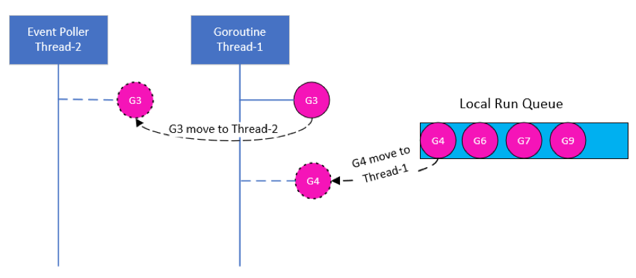
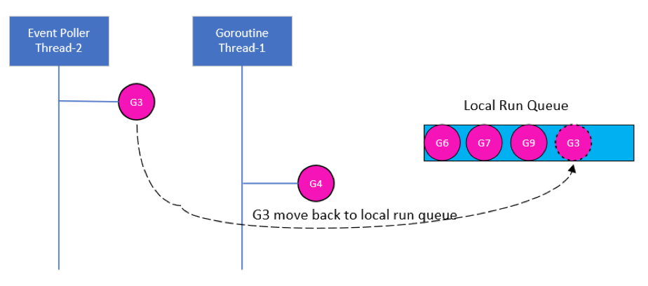
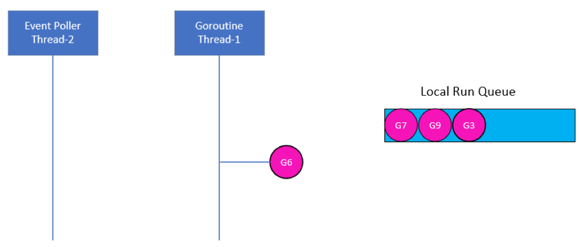
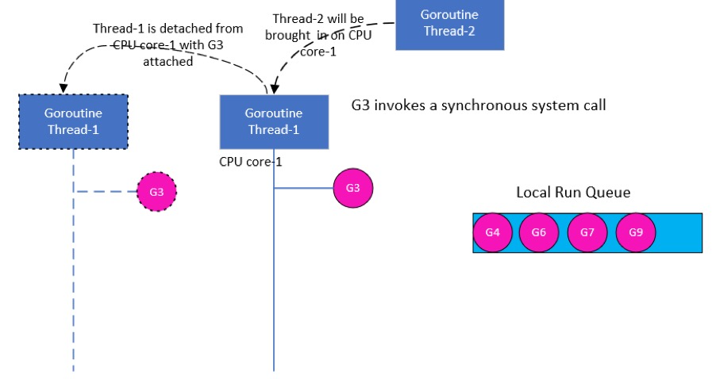
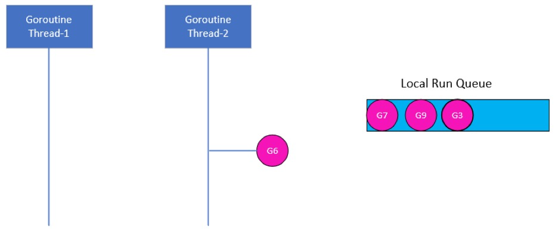

*by:* xiaosu lyu, cuidi wei and huadong hu


This is a short blog talking about Goroutines. If you are a newbie to Goroutines, this is the exactly article you WANT!!!

---

## What’s the Difference Between Concurrency and Parallelism? ###

Let’s first make clear what’s the difference between concurrency and parallelism. To quote Andrew Gerrand(2013), “when people hear the word concurrency they often think of parallelism, a related but quite distinct concept. In programming, concurrency is the composition of independently executing processes, while parallelism is the simultaneous execution of (possibly related) computations. Concurrency is about dealing with lots of things at once. Parallelism is about doing lots of things at once.” If Andrew Gerrand’s explanation still makes you confused, think that concurrency is taking a set of instructions that would be executed in sequence and finding a way to execute them out of order but still producing the same result; and parallelism is executing each of these instructions independently at the same time. 

## What are Goroutines? ###

Go is a highly efficient language for concurrent programming, and Goroutines are functions or methods that run concurrently in the background cooperatively scheduled by the Goroutine scheduler. Goroutine scheduler is part of the Go runtime, which runs in user space, be responsible for scheduling and context-switching different Goroutines on and off OS threads. Goroutines run on a group of separate OS threads created by Go runtime; other main-Goroutines (functions or methods which run on the main thread) will not be blocked or affected. Other words, Goroutines and main-Goroutines can work concurrently.     

Goroutines can be thought of as lightweight threads (the difference between threads and Goroutines will be introduced in the following), but they are not threads. The cost of Goroutine’s creation and destroying is much cheaper compared to threads. To create a Goroutine, just add the keyword “go” before the routine/function/method you want to create. Here is an example:

```
package main
 
import (  
    "fmt"
    "time"
)

func HelloGoRoutine() {  
    fmt.Println("Hello Goroutine")
}
func main() {  
    go HelloGoRoutine()
    /* we are using time sleep so that the main program does not terminate before the execution of goroutine.*/
    time.Sleep(1 * time.Second)
    fmt.Println("main function ended")
}
```
The above program creates a Goroutine called *HelloGoRoutine* and it will be scheduled to execute by Goroutine scheduler on a separate OS thread rather than on the main thread, so *time.Sleep(1 * time.Second)* will run on the main thread, which concurrently run with *HelloGoRoutine*. This program will first output ```Hello Goroutine```, after 1 second later, ```main function ended``` will be printed out.

If we remove *time.sleep()*, the output will be ```main function ended```. What happened here? Code *go HelloGoRoutine()* starts a new Goroutine and *HelloGoRoutine()* will run on the Goroutine thread. *Println* will run on the main thread, so *HelloGoRoutine()* and *main()* are running concurrently in different thread. Other words, *Println* won’t wait *HelloGoRoutine* to finish but executes immediately. Therefore, *main()* finished immediately, not waiting for *HelloGoRoutine* to print ```Hello Goroutine```. 

To conclude, Goroutines:    
- Can be running concurrently with main Goroutines. main Goroutines do not wait for this Goroutine to finish but run concurrently with it. From programming’s perspective, Goroutines return immediately from its call.
- If the main Goroutine is terminated, all other Goroutines will stop and the program will be terminated.

### What’s the difference between Goroutines and Threads? ###

Thread is the minimum unit of execution scheduled by the OS scheduler. A thread will execute a set of instructions assigned to it sequentially until there are no more instructions for the thread to execute. Each process has at least one thread, called main thread. One thread can create multiple threads that will share fd (file descriptors), PIDS and memory space, but these threads will run independently of each other and scheduling decisions are made by the OS scheduler. These threads can run concurrently if they share one CPU core, or parallelly if they run on different CPU cores. To ensure fairness and efficiency, OS scheduler will decide what thread will be chosen to run in how much time. For example, if one thread is stopped and waiting for something in order to continue, like waiting for reading data from network, then OS scheduler will pull this thread off the CPU core and replace it with another thread that is not stopped and waiting for something. This is called context-switch. Context-switch is considered to be very expensive because it takes time to swap threads on and off a core, which involved in saving/restoring status of all registers. Also, for those threads running on multiple cores, synchronizing data in shared memory and L1 cache will take more time than tasks running on isolated memory. Threads have large stack size (>1Mb) and have to save and restore a lot of registers. These properties render threads slow.



Goroutines can be seen as lightweight threads because the Goroutine scheduler will context-switch Goroutines on and off a thread, which is not like the OS scheduler that context-switch threads on and off a CPU core. Like threads, a Goroutine can also be stopped and waiting for something in order to continue, which will cause the Goroutine scheduler context-switch this Goroutine off the thread and move another runnable Goroutine on the same thread to make the thread stay busy and not go idle. However, compared with thread, context-switching Goroutines is less cost than context-switching threads because only 3 registers need to be saved and restored. Therefore, Goroutines is much lighter than threads.  

To conclude, Goroutines have the following advantages compared to threads:
- Goroutines exist only in the virtual space of the Go runtime and not in the OS.
- Goroutines have smaller stack sizes (2Kb). 
- Goroutines Save/Restore only 3 Registers when doing context-switching.



## When does Goroutine scheduler make scheduling decision?
There are 4 types of events that can give Goroutine scheduler an opportunity to make scheduling decisions. These 4 types of events are the following:

 * The use of keyword “go”. 
 * Garbage collection. 
 * System call. 
 * Synchronization and Orchestration. 

 ### The use of keyword “go”
 When use “go” to create a new Goroutine, that will give the Goroutine scheduler an opportunity to make scheduling decision.
 
 ### Garbage collection
 GC has its own set of Goroutines. When GC is running, some scheduling decisions will be made.
 
 ### System calls
 System calls that will cause Goroutines to block on threads can make scheduler to make scheduling decisions. Scheduler will context-switch the blocked Goroutine off the thread and context-switch a new runnable Goroutine on the same thread. However, sometimes, a new thread needs to be created to run Goroutines of the queue, this situation will be explained in the following part.

 
 ### Synchronization and Orchestration
 This involves atomic, mutex, or channel operation calls, which will cause the Goroutine to block. When this happens, the scheduler will context-switch a new Goroutine to run. When the blocked Goroutine can be runnable again, it will be re-queued and waiting to be executed.
 
 ## Three typical Goroutine scheduling schemes
 This part will introduce three typical Goroutine scheduling schemes which will cover the situations of asynchronous system calls, synchronous system calls, and work stealing.
 
 ### Asynchronous system calls
 The very common asynchronous system calls are network reading and writing. Most operating systems provide an event poller which can be used to handle asynchronous system calls more efficiently. This event poller refers to epoll(Linux), select(Linux/Windows), or kqueue(MacOS).
 
 Since the event poller also can block the current Goroutine since it is waiting for some events to happen, so Go runtime creates a separate OS thread to process the event poller. When a Goroutine running on a thread wants to make an asynchronous system call, like reading data from network, it will be moved to the event poller thread to wait for the data coming, while other Goroutines queued on the same thread can be context-switched to running. The benefit of this is that the asynchronous system call Goroutine won’t block other Goroutines. See the following image:
 
 
 
 G represents Goroutine. G3 is running on Thread-1, but it invokes an asynchronous system call. The scheduler detects G3 is doing an asynchronous system call, so it moves G3 from Thread-1 to the event poller thread – Thread-2. Other Goroutines in the same local run queue – G4 can be context-switched to Thread-1 to run. Like the following image:
 
 
 
 After G3 finished its asynchronous system call, the scheduler will move it back to the queue waiting for running, and Thread-2 becomes idle, like the following image:
 
 

 ### Synchronous System Calls
 What if a Goroutine makes some system calls that are not be done asynchronously? For example, reading a file to memory is a synchronous system call. In this situation, event poller cannot be used for handling synchronous system calls, so this Goroutine will block the current thread. However, such situations cannot be prevented, but do we have solutions for this case? When this happened, the scheduler will detach the current thread with the blocked Goroutine attached from the current CPU core, and bring a new thread to service the current CPU core. The new thread can be some previous existing swapped thread or a new thread created by the Go runtime. When the blocked Goroutine finishes its synchronous calling, it will be moved back to the queue waiting for the next running. In this scenario, a real thread context-switching will happened once, however, other Goroutines are not blocked by the synchronous calls and still can be processed. See the following image:
 
 

 G3 running on Thread-1 invokes a synchronous system call, let’s say it reads a file to memory. This synchronous call will block the current thread – Thread-1, the scheduler identifies this and detaches Thread-1 from the current CPU core-1 with G3 still attached, and bring a new thread – Thread-2 to service on CPU core-1. Then, other Goroutines, like G4 can be handled by Thread-2. See the following image:
 

 
 When G3 finished its synchronous calls, it can be moved back to the queue and waiting for the next scheduling. Thread-1 can be saved for later use. See the following image:
 
 
 
 ### Work Stealing
 Work stealing means when one Goroutine thread finishes all Goroutines in its queue, it will try to steal Goroutines from other threads’ queue or from the Global Run Queue. This scheduling scheme keeps threads always busy and not go to idle. When a thread tries to steal works, it first checks other threads’ queue, if there are Goroutines, it will steal half of what it finds; if there is no Goroutines, it will check and steal Goroutines from the Global Run Queue.
 
 ### References:
 
 https://www.ardanlabs.com/blog/2018/08/scheduling-in-go-part1.html
 https://www.ardanlabs.com/blog/2018/08/scheduling-in-go-part2.html
 https://www.ardanlabs.com/blog/2018/12/scheduling-in-go-part3.html
 https://medium.com/@riteeksrivastava/a-complete-journey-with-goroutines-8472630c7f5c
 https://www.youtube.com/watch?v=cN_DpYBzKso&t=422s
 https://gwadvnet20.github.io/slides/2-scalability-performance.pdf

