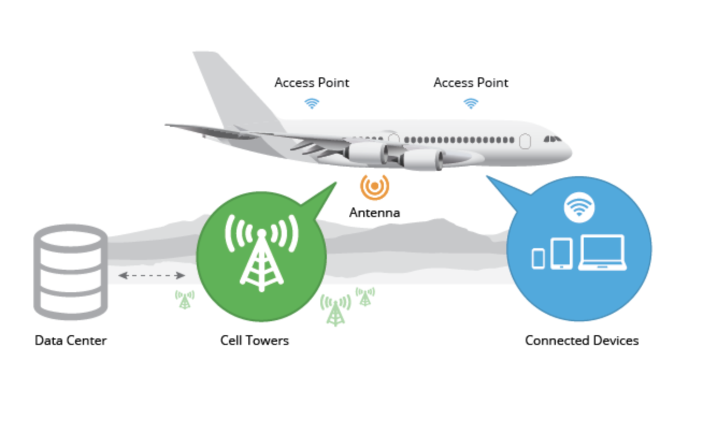
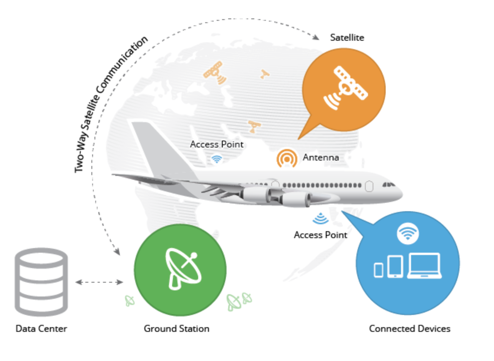

*by:* Katie Bramlett and Sreya Nalla

 

**How exactly does wifi work on your airplane 35,000+ feet in the air?
Here's a look at exactly how In-Flight WiFi keeps you connected to the world below.**

We'll discuss the basics of in-flight wifi, ground-based and satellite operating systems, and how moving from one atmosphere to another can affect the network performance.

---

Have you ever stopped to consider exactly how an e-mail or streaming video gets into your smartphone or tablet when you're cruising thousands of feet in the air? That's WiFi in action. When any two devices or machines need to communicate with each other, they need certain standards and protocols to be defined such that they are now able able to communicate. WiFi is that set of standards that defines communication for wireless computer networks. WiFi functions by using radio frequencies to send signals between devices. This radio frequency is different from that of your average walky talkie, car radio or weather radio, as WiFi transmits and receives data in the Gigahertz (Ghz) range.

### So, what does this mean?
To break it down a little further, Hertz (Hz) is only a measure of frequency. Let's say you were sititng by the ocean watching the wave roll in. If you were to count the number of seconds that passes between each wave, you'd be measuring the frequency of each wave. So, if 1 second were to pass between two waves, the wave frequency would be 1 Hz, or one cycle per second. In order to receive any information that is being send between these waves, the receiver needs to be set on a frequency that can read this incoming information at the correct rate. 

For WiFi, this frequency happens to be 2.5 Ghz or 5 Ghz (similar to that of a microwave!). The primary difference between these two frequencies lies in the range and bandwidth, which is the captacity of speed the network can provide. The 2.4Ghz frequency provides coverage over a larger range, but is only able to transmit data at lower speeds (smaller bandwidth), while the 5Ghz frequency provides coverage over a smaller range, but is able to transmit data at much faster speeds due to a larger bandwidth. 

### Does In-Flight WiFi work the same way?
Most of the technology behind the miracle of airplane wifi largely resembles that of wireless internet on the ground. To bring connectivity services to each passenger, planes first need to establish a connection to an Internet source. This is done using either an air-to-ground or satellite network. Once a connection is established using one of those two sources, connectivity can be provided to passendgers via WiFi hotspots. Airplanes use many of the same towers and satellites that deliver data to our smartphones, connecting to towers on the ground, or to satellites, or to both.

 Air-to-Ground Networks | Satellite Networks 
- | -
Airplanes use Air-to-Ground (ATG) networks to establish connectivity when traveling directly over land. The airplane should automatically connect to signals sent to its antennas, located on the bottom of the fuselage, from the nearest tower on the ground. This should allow for no interruptions if the airplane is flying only over populated regions of land. However, when travelling over remote terrain or large bodies of water, connectivity can often be a problem with this type of network. | Airplanes can utilize satellite technology for connectivity to WiFi when flying anywhere around the globe, whether they are flying over land or water. Using satellite antennas on the top of fuselage, the airplane is able to communicate with the nearest satellite in orbit. Since the satellite is continuously in connection with a tower on the ground, there is a constant supply of network connectivity to the airplane.
 | 

### How do we measure the performance?
So how do we know if our in-flight WiFi network connection is performing at it's maximum capacity? Is the performance as expected or should it be better?

We can measure the performance of In-Flight WiFi, or any WiFi network connection using a variety of performance metrics. Focusing specifically on bandwidth and throughput, however will provide us with the answers we are looking for. 

### Bandwidth
A common misconception is that bandwidth is a measure of speed. Rather, bandwith is synonymous with capacity. It is the maximum amount of data that can travel through a link or network, measured in bits per second (bps). Bandwidth describes the *theoretical* data transfer rate that should occur, whereas the throughput describes the *real world* data transfer rate of the network.

Often, we use the water pipe analogy to explain how bandwith works. The wider the pipe (larger diameter), the more water that can flow through. Simililarly, the more bandwidth a data connection has, the more data that can be sent and received at the time. That being said, bandwidth can be understood as the capacity for speed.
 
**Differences Between Bandwidth and Throughput**
Bandwidth and throughput are very similar, as they both measure the rate of data transfer. However, we note an important distinction:

- Bandwidth is the theoretical maximum rate of the network speed, or the rate of network speed that is possible
- Throughput is the real-world, or current, rate of the network speed that the user is experiencing

#### How can we measure bandwidth? 
Bandwidth is generally measured using software or firmware, and a network interface. Common bandwidth measuring utilities include the Test TCP utility (TTCP) and PRTG Network Monitor, for example.

Typically, to measure bandwidth, the total amount of traffic sent and received across a specific period of time is counted. The resulting measurements are then expressed as a per-second number.

Another method of measuring bandwidth is to transfer a file, or several files, of known size and count how long the transfer takes. The result is converted into bits-per-second (bps) by dividing the size of the files (bits) by the amount of time (seconds) the transfer required. Most internet speed tests use this method to calculate the connection speed of a user’s computer to the internet.

**Our Quick, Basic Approach**

We took it upon ourselves to see how we could possibly test for bandwidth performance. We decided the most basic approach would include a connection between a client and a server in which one end sends files to the other. This interaction would be timed from the time the server sends the file/package until when the receiver recieves the file/package. By timing the interaction, we are able to apply the following forumla to calculate the real-time rate of data transfer on a given network connection (i.e. throughput):

`throughput = packet size (bits) / send time (seconds)`

*Note that we would want to run this test more than just a handful of times so that we can get a variety of values that will present us with a meaningul throughput average*

By measuring the throughput in this way, we are able to compare it to the bandwidth that is actually specified by the network that we are using. Comparing the throughput to the bandwidth would allow us to gage whether our user-specific network performance is of high-quality or not, given we know the bandwidth.

*An excerpt of the code for the server can be seen below:*
```python
while True:
   # Establish a connect with the client
    conn, addr = s.accept()
    print ('Got connection from', addr)

    #start time from when connection begins
    start = time.time()

    # get file
    filename='test.txt'
    # get file size (in bytes) and convert to bits
    fsize = (os.path.getsize(filename))*8 #1 byte = 8 bits

    #open file, read, send
    f = open(filename,'rb')
    l = f.read(1024)
    while (l):
       conn.send(l)
       print('Sent ',repr(l))
       l = f.read(1024)
    # close file
    f.close()
    if f.closed:
       break
# calculate time taken to send given file
runtime = time.time() - start;
print('Done sending')
print('total send time: %.2f ', runtime)
# calculate and output throuhgput measured in bits/second
print('throughput: %.2f ', fsize/runtime)

# close the connection between client and server
conn.close()
print('server connection closed')
```
*See the full code repository [here](https://github.com/katiebramlett/gwAdvNet20.github.io/tree/master/wiki/inflightWifiBlog/sampleCodePython)*<br/>

 **But, what ratio of throughput to bandwith values indicated good network performance?**
 There is no set value or percentage that indicates that a specific throughput to bandwidth ratio is good. However, we can conclude that a 1-to-1 ration would indicate that the throughput indicates we are working with a real-time rate of data transfer that is at max capacity. Likewise, we would be able to say that a ratio of 20% is probably something should be checked out, as the user might not be getting the most out of the network's bandwidth.

 Of course if we were to run this data on an airplane or over a large scale, we would need to consider a few amends:

- make sure the client connects to the airplane's server/network connection
- run the sample code more than just a handful of times (this will give is a more widespread understanding of the throughput we're are experiencing)
- try sending files of different sizes or multiple files at once
- test in different conditions e.g. over land vs. over water, in turbulence, over remote regions

**How can we take this test further?**
This basic test can be applied in several different situations to see the affects on throughput. First, we can run the test in different conditions, as stated above. For example, we can run the test over land and over water, in turbulent conditions, over remote regions, and in different altitudes. Also, we can run the test onboard different airline companies. The difference in output across all of these situations will give us key insight into the problematic affects on throughput.

**Outside Factors that Affect Throughput**
In real world networks, bandwidth varies over time depending on use and network connections. As a result, a single bandwidth measurement says very little about actual bandwidth usage. A series of measurements can be more useful when determining averages or trends.

Likewise, what the user experiences in terms of network data transfer rate is affected by several factors including, but not limited to:

- processing power of physical hardware 
- packet loss
- network congestion
- latency
- enforced limitation

**Why do we care about bandwidth? How would we use this information?**

- Are we getting our money's worth? 
- Is there something that can be fixed?
- Are airplanes able to foster maximum capacity? Is what we pay for what we actually get?
    - How can we tell? Calculate bandwith
    - Ways to calculate bandwith
- How can planes begin to maximuze bandwidth?

### Are there ways to improve performance?
Now, let's take a further look into how to improve performance. It is often found that In-Flight WiFi is slow or problematic. There are many ways that companies can try to improve these issues.
#### What is currently available?
In today's world, technology is developing rapidly and the number of devices using Wi-Fi is higher than ever before. The first In-Flight WiFi service was launched in 2008, and at the time, a 3 Mbps connection was enough for a small number of laptops. But now, most likely every passenger will have at least one device. They may be trying to stream video, listen to music, use mobile applications, and connect to websites. Therefore, there is a much greater strain with the resources available. To simplify, it is a large case of not enough supply and too much demand.

In 2017, a satellite connection offered roughly 12 Mbps. However, satellites are expensive to maintain and upgrade, which contributes to delays in technology upgrades -- meaning it causes In-Flight WiFi to lag behind. Also, there are still a lot of planes that still only use ground towers rather than satellite connections, and many companies are in the process of updating.

As a whole, In-Flight WiFi is a very expensive technology. Between satellite, antenna, engineering, and maintenance costs, there are a lot of expenses to account for. Some airline companies offer free WiFi onboard, while others charge for the service.

All of these reasons have contributed to slow and problematic In-Flight WiFi services.

#### 2018 CNN Top 5 Rankings of Most Tech-Friendly Airlines:
**Best In-Flight WiFi Services**
1. Qatar Airways
2. Emirates
3. Delta Air Lines
4. British Airways
5. JetBlue Airways

#### What research/work is being done as we look towards the future?
Many people question if In-Flight WiFi will get better and faster in the future. On the bright side, there are many companies that are at the forefront of research and advancements into improving the performance of In-Flight WiFi. Here is an overview of some of the work that is being done.

American Airlines announced in June 2019 that more than 700 of their planes had been upgraded with satellite-based WiFi, a project nearly two years in the making.

The best-known company in airline WiFi, Gogo, is constantly working on improving the performance of in-flight connectivity. Gogo announced in May 2019 that it would be introducing a faster 5G network for smaller planes that use air-to-ground networks in 2021.

In-Flight WiFi is a field that has lots and lots of room for growth, and it looks like in the near future there could be much better connectivity to the millions of people that fly everyday.

<br/>
**Sources Used:**
"How Does It Work?" *Altitude*, [www.connected-altitude.com/services-technology/how-inflight-wifi-works/.](www.connected-altitude.com/services-technology/how-inflight-wifi-works/) Accessed 20 Feb. 2020.

O'Hare, Maureen. "Airlines with the Best Wi-Fi and Inflight Tech." *CNN*, 19 Oct. 2018, [www.cnn.com/travel/article/best-wifi-airlines/index.html.](www.cnn.com/travel/article/best-wifi-airlines/index.html) Accessed 20 Feb. 2020.

Plush, Hazel. "How does Wi-Fi work at 35,000 feet and why don't all airlines offer it?" *Telegraph*, 30 Jan. 2017, [www.telegraph.co.uk/travel/travel-truths/how-does-inflight-wi-fi-work/.](www.telegraph.co.uk/travel/travel-truths/how-does-inflight-wi-fi-work/) Accessed 20 Feb. 2020.

Sampson, Hannah. "Airplane WiFi is getting better. But why is it still so bad?" *Washington Post*, 21 June 2019, [www.washingtonpost.com/travel/2019/06/20/why-is-airplane-wifi-still-so-bad/.](www.washingtonpost.com/travel/2019/06/20/why-is-airplane-wifi-still-so-bad/) Accessed 20 Feb. 2020.
