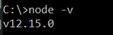
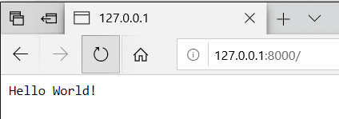
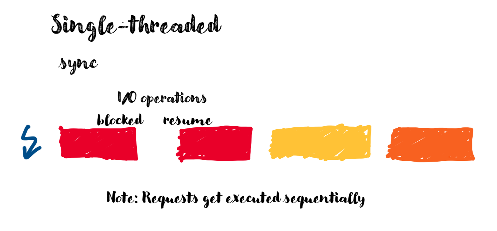
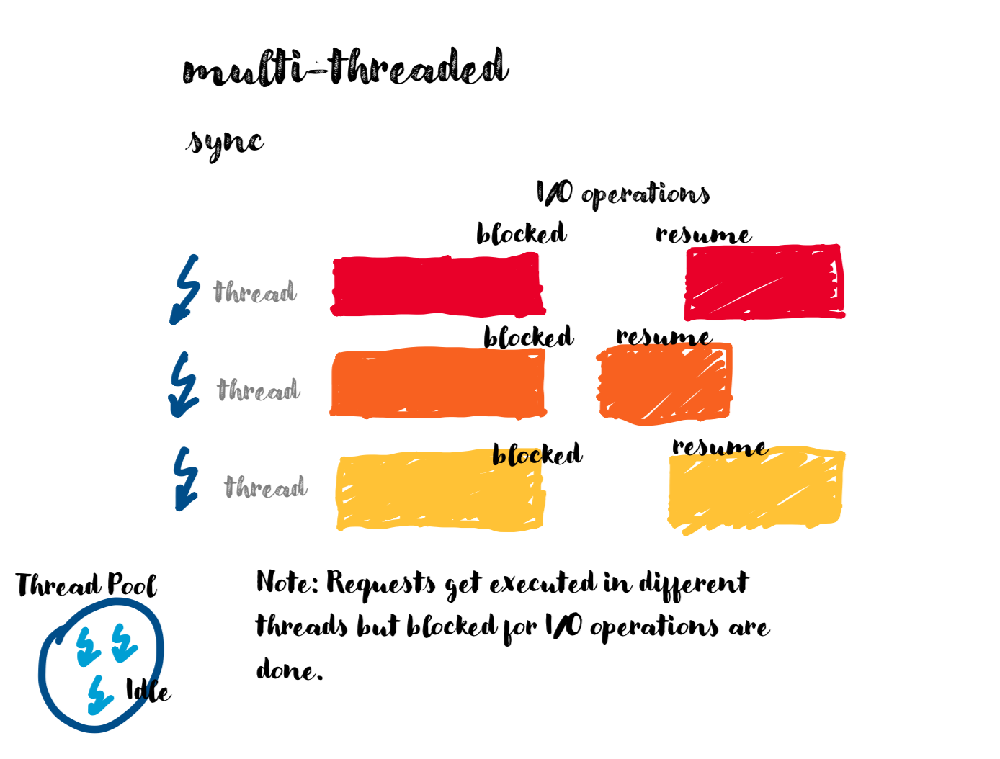
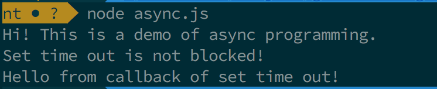
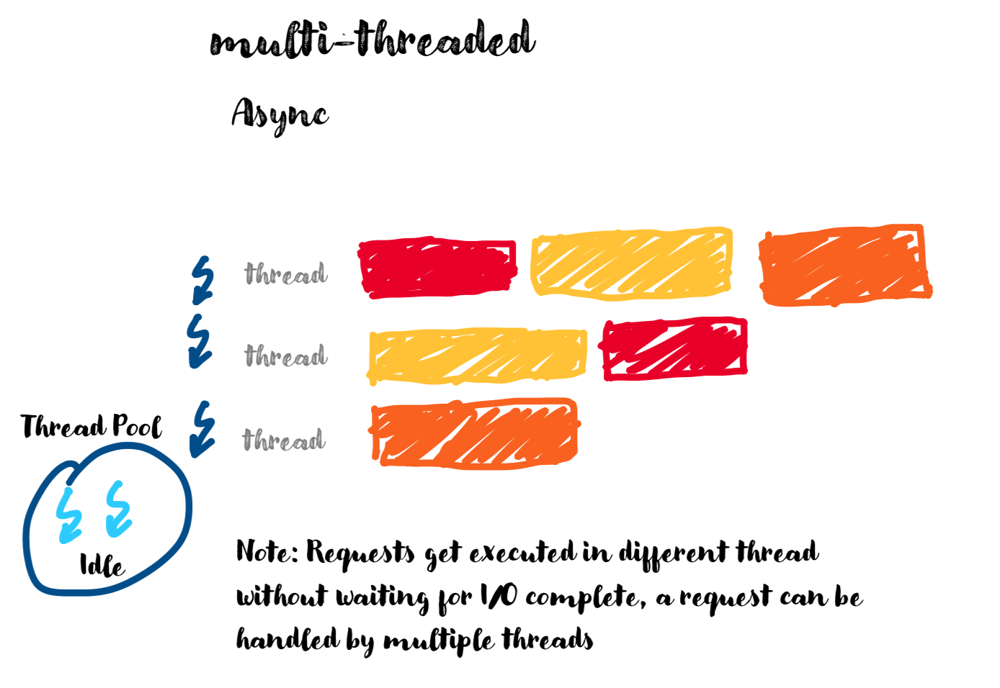
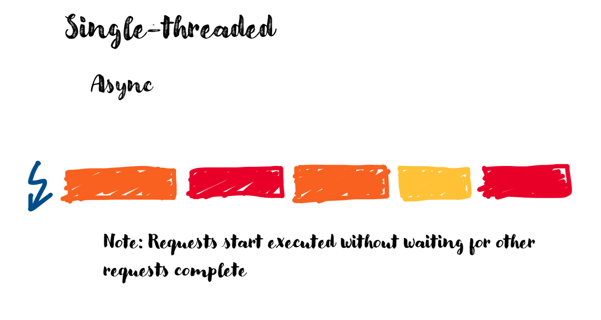
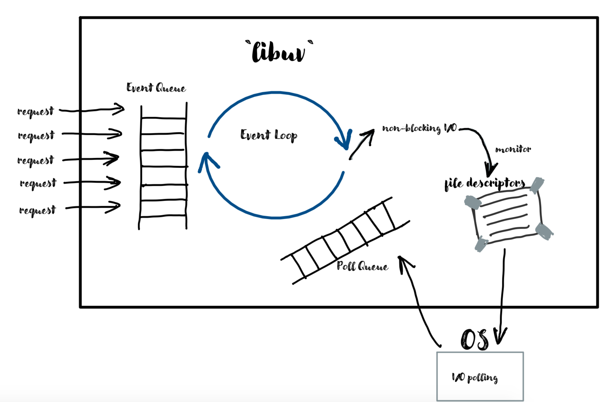
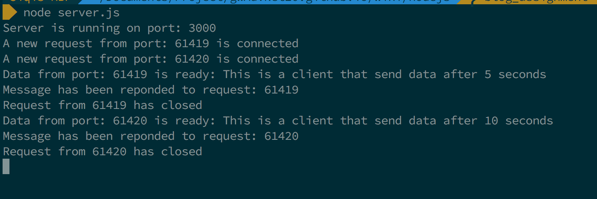
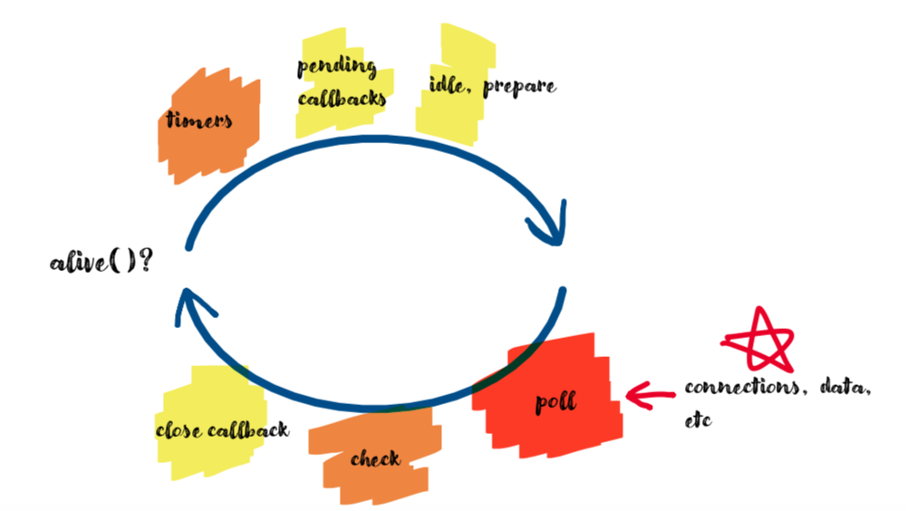

*by:* Mingyu Ma, Siqi Wang

<script src="https://kit.fontawesome.com/4998fcb39c.js"></script>
<script src="https://code.jquery.com/jquery-3.1.0.min.js"></script>
<script src="/assets/js/lightslider.min.js"></script>
<link type="text/css" rel="stylesheet" href="/assets/css/lightslider.min.css" />

<script type="text/javascript">
$(document).ready(function() {
    $("#slider").lightSlider({
        item: 1,
        mode: "slide",
        auto: false,
        loop: false,
        controls: true,
        pager: true,
    });
    $("#slider2").lightSlider({
        item: 1,
        mode: "slide",
        auto: false,
        loop: false,
        controls: true,
        pager: true,
    });
});
</script>

This blog is a detailed tutorial about the architecture of Node.js.

---
# Setup Environment

To set up a node.js environment, you can either download the installer from the node.js website, [**node installer download**](https://nodejs.org/en/). It provides long term support version and the latest version for Windows, MacOS, and Linux.

Another way to do is to install it via package manager. All information can be found on the same website [**node package download**](https://nodejs.org/en/download/package-manager/).


After the installation you also need to setup the environment variables.
 -  For Windows system the default path is `C:\Program Files\nodejs`. To add it to the environment variable you can ran the following command on your command line prompt:
 `SET PATH=C:\Program Files\nodejs;%PATH%`
 And then run `node -v` to check if you had successfully installed Node.js.

     

     This means you had successfully installed Node
 -  For Linux system you can run the following command:
    ```
    #The last part is depend on the version you installed
    export NODE_HOME=/usr/local/node/12.15.0
    export PATH=$NODE_HOME/bin:$PATH
    ```
    Finally run `node -v` to check if you had successfully installed.

 -  For MacOS you can either install by downloading from the website or you can use brew to install, simply run `brew install node` to install Node.js.

# Intro of Node.js

Node.js is a asynchronous event-driven JavaScript runtime. It is designed to build scalable network applications.

Node.js is designated to build a non-blocking environment, it is in contrasts to other concurrency model which employs OS threads more often. Node.js is build entirely around this concept of event loop, which is a **asynchronous loop** used to handle all incoming requests.

Node does not need any function calls to start its event loop, it simply enters the event loop after it starts executing the input file. Therefore the event loop is kept hidden from the user, and sometimes it is difficult to detect how event loop performs under the hood.

This is an example of a hello world program in NodeJS:
```JavaScript
var http = require('http');

http.createServer(function (request, response) {
  // because this is a HTTP header, you need to specify the response type
  // 200 represent HTTP status OK
  // text/plain specifies the type of response message
  response.writeHead(200, {'Content-Type': 'text/plain'});

  // send Hello World message
  response.end('Hello World!\n');
}).listen(8000);

console.log('Server running at http://127.0.0.1:8000');
```
You can run it in shell with
```
node HelloWorld.js
```
And then you can open any web browser, enter the URL and you will see the hello world message on that web page.



## How Node.js execute Javascript Program?

Node.js is built using the **V8 JavaScript engine**. **V8** is a engine built by Google Chrome development group, the purpose of it is to directly run JavaScript files as users using the web browser.

**V8** is a JIT(Just-In-Time) compiler, which means it compiles the program at the run time. It directly transfer the JavaScript code into machine code, which then be executed by the machine. JIT compiler is expected to be faster than traditional compiler, which users have to compile the code first and then runs the executable file generated by the compiler.

Since **V8** is built using C++, large portion of Node.js is also built with C++ runtime. Even though it does not affect how a JavaScript program is executed by Node.js, but some of the feature is made available because of C++.

When you start executing a JavaScript server. Node will do several things.
 -  First Node will look at all of the `require()` function and "requires" all of the modules. Because node is asynchronous, it will then check all the events in the program and register the **callback** function followed that event.
 -  Then Node will enter its Event Loop, using the registered callback functions to respond to incoming client requests.
 -  Depending on the type of request things will be handled differently, and we will talk about that in the next section.


# Multi-threaded, Single-threaded, Sync, Async...
<i class="fas fa-question" style="color:red;font-size:40px;"></i> How to improve performance (increase responsive, reduce latency) for a heavily I/O application?
### THREADING

This is a comparison of how single-threaded and multi-threaded architecture works:
<ul id="slider">
<li>  </li>
<li>  </li>
</ul>

### ASYNC programming

Remember when you order food in Chipotle, you don't block the order line and next customer could start to order food immediately. Similaly, in an event-based programming, there is generally a listener that listens for events, and then triggers a **callback** function when one of those events is detected.
> A callback is a function called at the completion of a given task.

There is a quick demo of asyn programming:
```javascript
console.log('Hi! This is a demo of async programming.');
setTimeout(() => {
    console.log("Hello from callback of set time out!")
}, 5000);
console.log("Set time out is not blocked!");
```


There is a comparison of async programming model works in single-threaded and multi-threaded architecture.
<ul id="slider2">
<li>  </li>
<li>  </li>
</ul>

<i class="far fa-laugh-beam" style="color:#ffbf00;font-size:40px;"></i> Cheers! Now you have good understanding of Node.js **single-threaded** architecture, as an **async** platform.

## But how...?
Node is faster and less resource intensive when it comes to handling I/O operations asynchronously. You might have some questions in mind.
> "I/O" primarily refers to interaction with system's disk and network.

- Who will handle blocking I/O tasks?

Node will offload the jobs to **kernel**. Node takes advantage of the fact that modern operating systems’ kernels are multi-threaded. It seems like what the Node does is to tell the kernel,"what I am interested in", and "please tell me when you are done".
- How does Node know that which time to handle callbacks?

Once the I/O task is finished, the callback will be pushed into a callback queue instead of executing the callback right away.

But how? Specifically, Node asks a friend, [**`libuv`**](http://docs.libuv.org/en/v1.x/api.html), to help Node manage async I/O operations.


## Say Hello to Event Loop

`libuv` provides **event loop** which takes care of polling for I/O and scheduling callbacks to be run based on different sources of events. Event loop is a loop, semi-infinite `while` loop, running inside function `int uv_run()` and in the main thread.

Continue on previous question... How `libuv` tells kernel what I am interested in? Library `libuv` has a collection of **file descriptors** that it asks the OS to monitor, using a polling mechanism, like `epoll` in Linux.

> OS typically provides event notification interfaces for asynchronous I/O (epoll in linux, kqueue in macOS, IOCP in Windows etc.).

Because of this mechanism, i.e., OS does job without back and forth threads, it happens in the main thread, the single thread. Once the job is done, OS will signal the event loop and then event loop invokes the **callbacks** associated with the event and appends them into the **poll queue**.

This is how Node serve concurrent requests:


### What will happen after `node server.js`?

Let's go through an example to understand how event loop works.`server.js` is a simple Node application, printing out the data from incoming requests and reponsing with a message.

```javascript
/* A simple Node.js server: echoing client's data and responsing with a message.
* This code snippet is used for a tutorial of Node.js single-threaded architecture.
* If you are interested, please checkout: [link]
*/

// import net module
const net = require('net');
// port is hard-coded, use assigned port when in production
const port = process.env.PORT || 3000;

// Create a TCP server, createServer() will automatically set a connection listener
const server = net.createServer((socket)=>{
    console.log(`A new request from port: ${socket.remotePort} is connected`);

    // Listen for event: "data ready" on the socket
    socket.on('data', (data) => {
        console.log(`Data from port: ${socket.remotePort} is ready: ${data}`);

        // Write back to client
        socket.write(`Data has been received`, ()=> {
            console.log(`Message has been reponded to request: ${socket.remotePort}`)
        });
    });
    // Listen for event: "close" on the socket
    socket.on('close', () => {
        console.log(`Request from ${socket.remotePort} has closed`)
    })
});

// Listen for incoming request from port
server.listen(port, ()=> {
    console.log(`Server is running on port: ${port}`)
})
```

Once we run `node server.js`, Node will start a process and our code will be executed inside event loop. The first event `server.listen()` completes, the callback funtion `console.log()` will be pushed into poll queue. Event loop will execute `console.log()` immediatelly. Currently, the poll queue is empty, event loop will wait for callbacks.

Let's move on...Sending two requests to this server, but the actual data transmission will begin 10 seconds and 5 seconds, respectively, after connection. Once there is a request "A" comming (socket connection), the `console.log()` will be pushed into poll queue and executed by event loop. Then, Node asks OS to monitor if the data is ready on `socket A`. Node will **NOT** wait for the data ready, it continues to serve request "B", similarly the `console.log()` will be pushed into poll queue and executed by event loop. Again, Node asks OS to monitor if the data is ready on `socket B`.


### Deep Dive into Event Loop

There are so much details inside each iteration. Actually, different callbacks will be executed in different phases:

The phases below we care about most:
#### Timers
This phase executes callbacks scheduled by `setTimeout()` and `setInterval()`. Timers callbacks will be executed *as early as* the specified amount of time has passed. However, OS scheduling or the running of other callbacks may delay them.

#### Poll
Poll phase retrieves new I/O events; executes I/O related callbacks (almost all with the exception of close callbacks, the ones scheduled by timers, and `setImmediate()`).

Once the loop enters **poll** phase, one of the scenerios will happen:
- The poll queue is not empty, the event loop will iterate through its queue of callbacks executing them synchronously.
- The poll queue is empty.
    - If the scripts has `setImmediate()`, the event loop will end the poll phase and continue to the check phase to execute those scheduled scripts.
    - If the scripts don't have `setImmediate()` and the timers have been reached, the event loop will wrap back to the timers phase to execute those timers' callbacks.
    - If the scirpts don't have `setImmediate()`and the timers haven't been reached, the event loop will wait for callbacks and execute them immediately.

#### Check
`setImmediate()` callbacks are invoked here.

#### Other phases
- **pending callbacks**: If the *previous* iteration deferred any I/O callback it will be run at this point.
- **idle, prepare**: only used internally.
- **close callbacks**: some close callbacks, e.g. `socket.on('close', ...)`.

## Is Node single-threaded?
Actually NOT really! Node provides two types of threads: **event loop (main thread)**, and **thread pool**, both of them provided by `libuv`. The pre-allocated thread pool has a default size of 4. The default size of the pool can be overridden by setting the environment variable `UV_THREADPOOL_SIZE`. Unlike network I/O, there are no file I/O primitives `libuv` could rely on, so the current approach is to run blocking file I/O operations in a thread pool. The thread pool is responsible for blocking `I/O` operations and CPU intensive tasks. For example, `crypto` module make use of thread pool.

>Note: `libuv` uses a thread pool to make asynchronous file I/O operations possible, but network I/O is **always** performed in a single thread, each loop’s thread.

```JavaScript
var http = require('http');
var crypto = require('crypto');

http.createServer(function (request, response) {
  response.writeHead(200, {'Content-Type': 'text/plain'});

  // send Hello World message
  var cipher = crypto.pbkdf2Sync('secret', 'salt', 10000, 512, 'sha512');
  response.end(cipher);
}).listen(8000);

console.log('Server running at http://127.0.0.1:8000');
```

This is an example that would require Node to use thread pool for each request, Node considered crypto as calculation heavy task and therefore it will use the **thread pool**.

# Summary
In summary, Node is not single threaded. Node provides two types of threads: **event loop (main thread)**, and **thread pool**, both of them provided by `libuv`. Node.js is highly scalable. Check out `express`, `socket.io`.

# Reference
1. [`V8` Engine](https://v8.dev/)
1. [Node.js `net` module](https://nodejs.org/docs/latest-v11.x/api/net.html)
1. [`libuv` docs](http://docs.libuv.org/en/v1.x/index.html)
1. [Node.js event loop](https://nodejs.org/uk/docs/guides/event-loop-timers-and-nexttick/)
