<link type="text/css" rel="stylesheet" href="/assets/css/lightslider.min.css" />

Raft is a fault tolerance protocol that uses state machine replication to allow a group of nodes to handle crash failures.

---

## 1. Appreciate "Understandable Consensus"
To start your Raft journey, begin by appreciating the history of what it builds on:

  - Read the Abstract and glance at (but don't read, unless you really want to) Lamport's [classic 1998 paper on Paxos](https://lamport.azurewebsites.net/pubs/lamport-paxos.pdf)
    - If you are curious, the [history of paxos](https://lamport.azurewebsites.net/pubs/pubs.html#lamport-paxos) is also a quick and interesting read
  - Next, read the Abstract and glance at (but don't read, unless you really want to) [Ongaro's 2014 Raft paper](https://raft.github.io/raft.pdf)
    - if you are curious, learn [why it is called Raft](https://groups.google.com/forum/#!topic/raft-dev/95rZqptGpmU)
  - Having looked at both papers, reflect on their similarities and differences

---

## 2. Learn the Basics of Raft

While the Raft paper is relatively easy to follow, we only expect you to understand the high level design. You may find it easiest to use the following approach:

  - Watch [Distributed Consensus with Raft - CodeConf 2016](https://www.youtube.com/watch?v=RHDP_KCrjUc)
  - Walk through the [Secret Lives of Data Raft Visualization](http://thesecretlivesofdata.com/raft/)
  - Read this overview [Raft: Consensus made simple(r)](https://www.brianstorti.com/raft/)

At this point you should understand the high level ideas in Raft. *Optionally*, if you want to go deeper:
  - Play around with this [Raft Simulator](https://observablehq.com/@stwind/raft-consensus-simulator)
  - Watch a [presentation by one of Raft's authors](https://youtu.be/vYp4LYbnnW8)
  - Read the full [Raft paper](https://raft.github.io/raft.pdf)
  - (You should not need to do this to solve the quiz)

---

## 3. Practice What you Learned

Step through these slides (or [look at the PDF](raft-practice.pdf)) and answer the questions. If you have questions, post on Slack in #a4raft!

<ul id="slider">
	<li>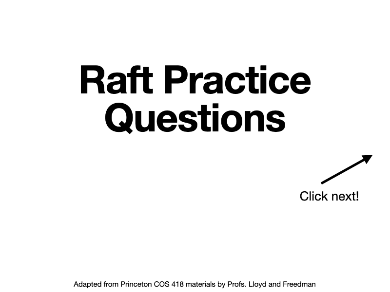</li>
	<li></li>
	<li>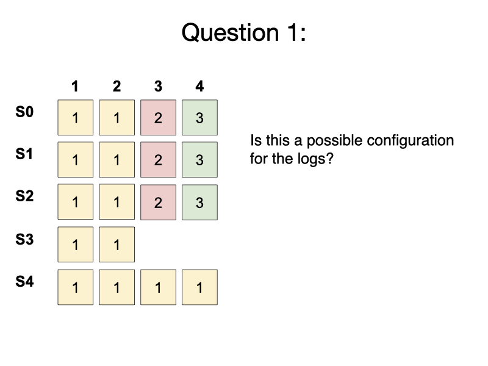</li>
	<li></li>
	<li>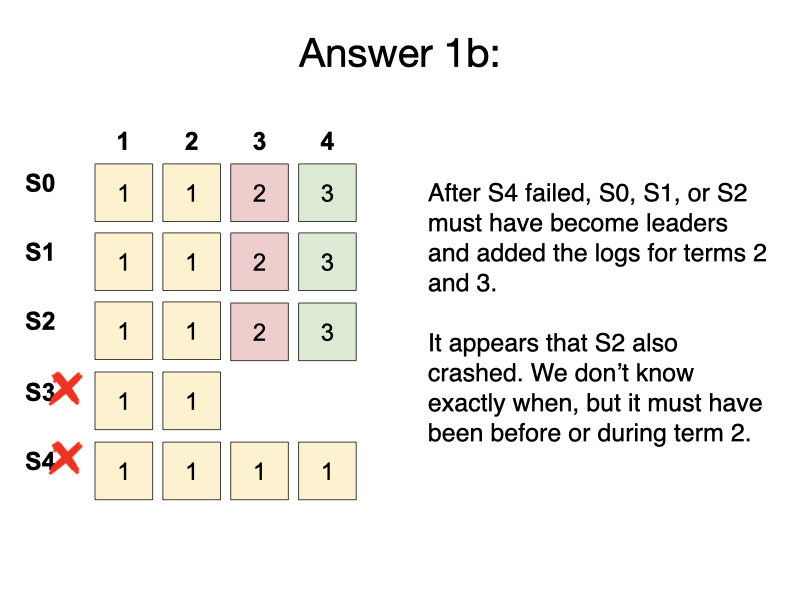</li>
	<li>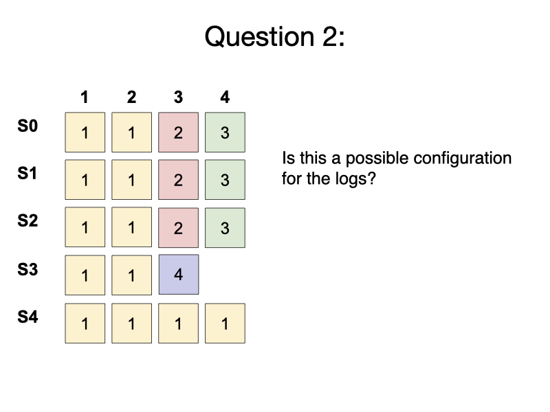</li>
	<li>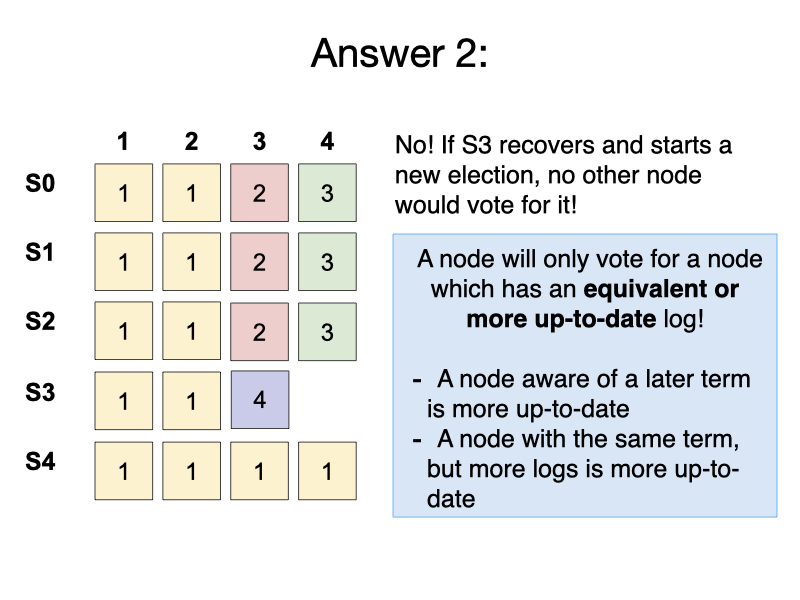</li>
	<li>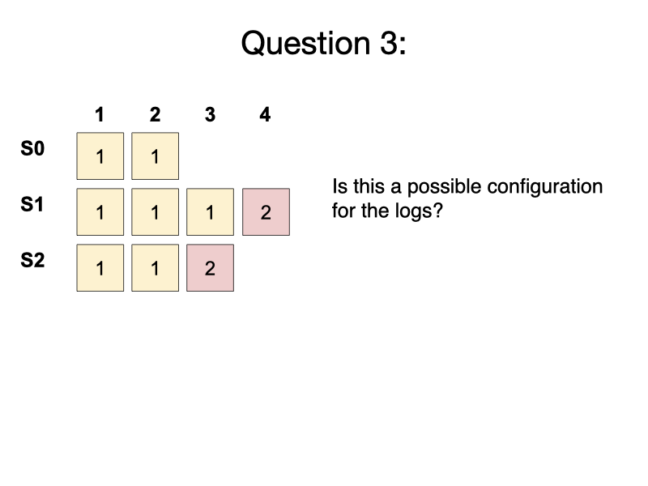</li>
	<li>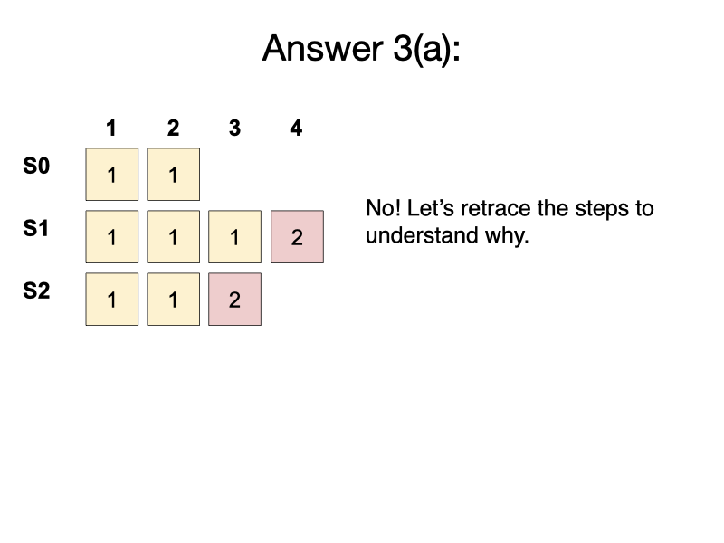</li>
	<li>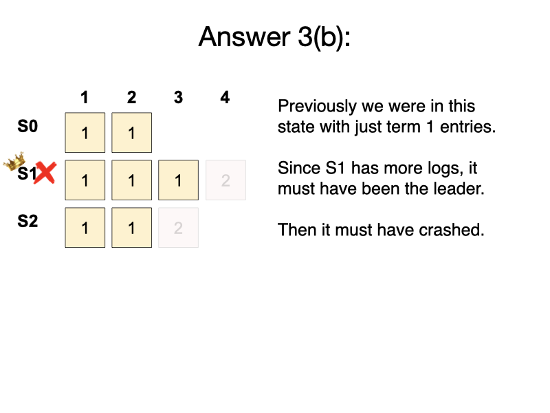</li>
	<li>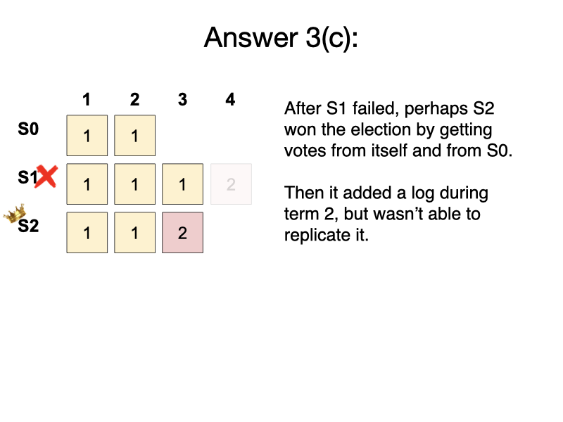</li>
	<li>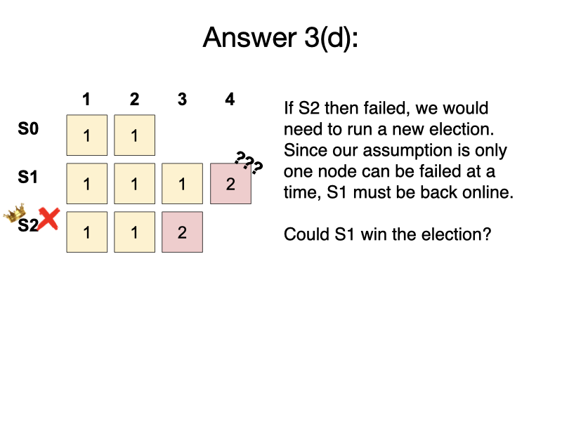</li>
	<li>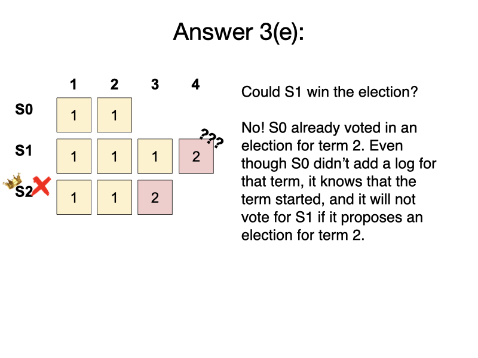</li>
	<li>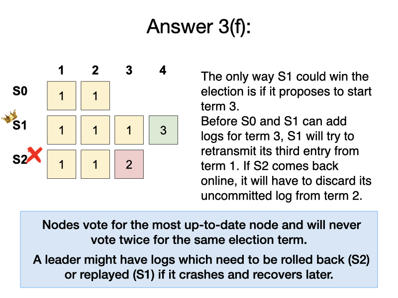</li>
</ul>

---

## 4. Take the Raft Quiz

Once you are comfortable with Raft, take the [Raft Consensus Quiz](https://docs.google.com/forms/d/e/1FAIpQLSda8Ew9m-J3-Dw7V8JSZWoYDQ6wgB-NoVoo-4Gq3piOEmIPzA/viewform?usp=sf_link).  See the [Tasks](/tasks/) page for due dates and details on allowed material for quizzes.

