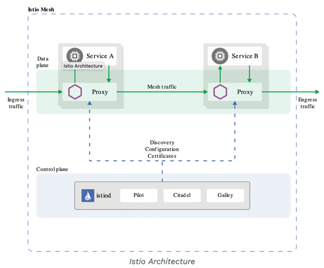
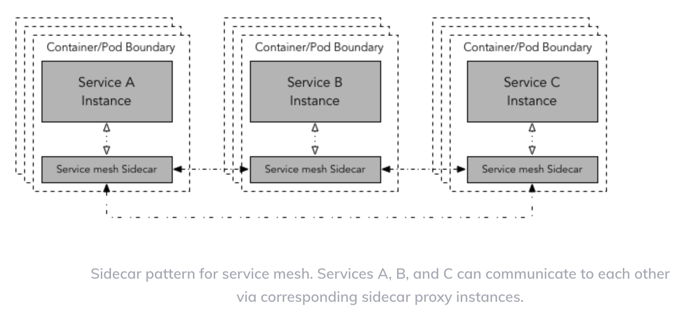
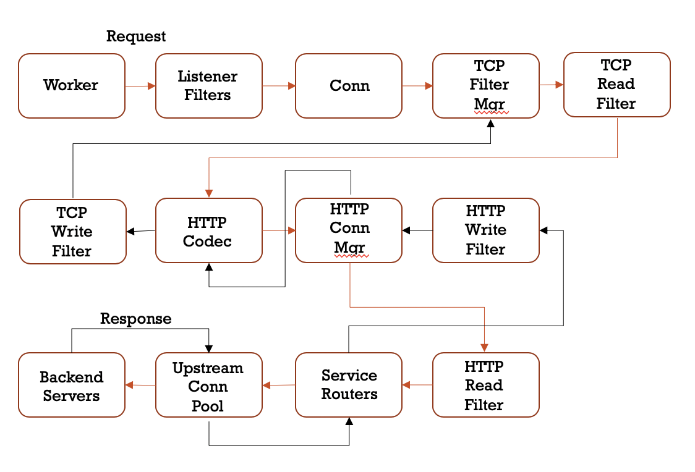
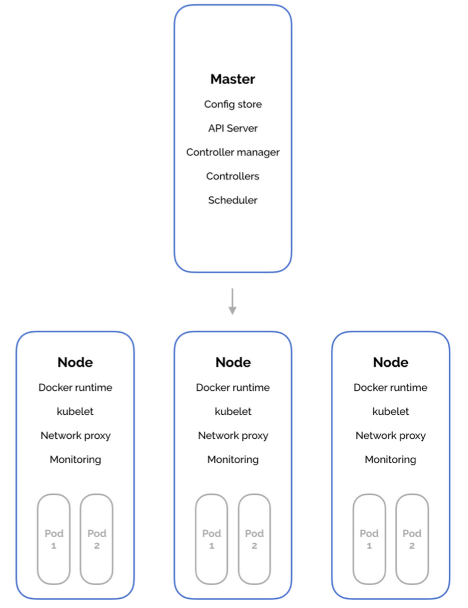

# Service Mesh

[https://en.wikipedia.org/wiki/Service_mesh](https://en.wikipedia.org/wiki/Service_mesh)

A service mesh brings together three concepts:

1. The control plane
2. The data plane
3. Microservices

A service mesh enables a user to specify rules about deploying and managing the microservices infrastructure and manage traffic between the different services. Furthermore, a service mesh also collects usage statistics from individual services, handles node failures and overload conditions and can be configured to handle autoscaling of services.

## Control Plane

The control plane is typically where decisions about various aspects of the infrastructure are made. These include, but are not limited to, traffic management rules, user authentication and so on.

## Data Plane

Once the decision is made by the control plane, the data plane&#39;s job is to implement these high level policies. For example, the control plane of a network router may specify rules to route traffic but the data plane physically forwards packets between the different components in the infrastructure.

A detailed explanation of service mesh can be found [here](https://blog.envoyproxy.io/service-mesh-data-plane-vs-control-plane-2774e720f7fc).

# Istio

[https://istio.io/](https://istio.io/)

Istio is a popular service mesh that has been developed at IBM. It has a control plane written, in house, with Golang by IBM. This control plane has components like _Pilot_, _Gallery_ and _Citadel_ (we will talk about them in a while). The data plane of Istio comes in the form of a proxy called _Envoy_ that was developed at Lyft.

The Istio control plane provides capabilities to perform traffic management, security and observability into services. Overall, the control plane lets users specify the services, the number of service instances in a YAML file. The YAML configuration file is then used to deploy services instances. Each service instance has its own sidecar proxy. These proxies form the data plane of Istio and set up the network between the services. Note that the Istio control plane is completely out of the data path in the traffic flow.



A Getting Started guide for Istio can be found [here](https://istio.io/docs/setup/getting-started/). An example YAML file can be seen [here](https://raw.githubusercontent.com/istio/istio/release-1.5/samples/bookinfo/platform/kube/bookinfo.yaml). This [link](https://istio.io/docs/ops/deployment/deployment-models/) provides a nice overview of how Istio can be utilized in different scenarios.

## Pilot

This component provides service discovery, traffic management, intelligent routing and resilience.

## Citadel

This component is responsible for providing service-to-service and user authentication.

## Gallery

This component is responsible for verifying the configurations, processing them and distributing to different components in the environment.


As can be seen in the diagram, Istio, through Envoy, can route traffic to specific _versions_ of a service based on user-defined rules. In the top diagram, 5% of all traffic between _SvcA_ and _SvcB_ is routed to a _canary_ version _SvcB&#39;_ (a canary version is a newly updated version that still needs to be tested).

Similarly, in the bottom diagram, traffic from different systems (Android and iPhone here) can be redirected to different versions.

The version of a service is simply an annotation that is provided in the YAML configuration file with the _apiVersion_ directive.

[Here](https://www.abhishek-tiwari.com/a-sidecar-for-your-service-mesh/) is a great article on sidecar architecture.

# Envoy

[https://www.envoyproxy.io/](https://www.envoyproxy.io/)

Envoy was developed inhouse at Lyft and is utilized by IBM to provide the data plane in Istio. Envoy is used as a reverse proxy by the Istio data plane. A reverse proxy sits in-front of a service and the service is reachable through the reverse proxy. The reverse proxy, and its networking, is managed by the Istio control plane. And since the reverse proxy takes care of networking the backend service, the user does not need to configure the network down to the detail of each service instance. A great article about proxies can be found [here](https://blog.envoyproxy.io/introduction-to-modern-network-load-balancing-and-proxying-a57f6ff80236).

Istio deploys each service instance as a _pod_ that contains a service instance and a reverse proxy, namely Envoy.



## Envoy Design

From 20\_000 feet, Envoy is a simple, elegant, multi-threaded software. It has three kinds of threads:

1. A main thread that ensures everything runs smoothly and aids in the communication between worker threads through thread-local storage (TLS). Envoy maintains a small buffer per thread that is used to send and receive messages from the main thread. A certain amount of synchronisation is required but much less than maintaining a global buffer protected by a mutex.
2. There are multiple worker threads, the number of threads defaults to the number of cores in the system. However, this can be changed in Envoy configuration YAML files. The worker threads are responsible for handling all connections. They work on an event-notification basis without blocking (asynchronously). Thus only a small number of worker threads can handle a large number of client connections. The workers are scheduled by the kernel.
3. There is a file flusher thread. Each worker thread when attempting to write to a file, like a log, will write to an in-memory buffer. The file flusher thread then flushes the buffer to the file independent of the worker threads. The in-memory buffer is protected by a mutex and there is a very small chance that worker threads can block on this thread.

## Filters

Envoy proxies work by chaining multiple filters together. A typical filter chain for HTTP can look like this:



Envoy creates _listeners_ that listen for specific events on a network port. There can be multiple L2/L3 (network) or L7 (HTTP) filters on the chain. These filters can provide a variety of functions like SSL/TLS termination, routing or HTTP encoding/decoding.

# Istio Service Registry

Istio (Pilot) uses a service registry to generate configurations for Envoy proxies. But Istio [does not provide a service registry by itself](https://istio.io/docs/concepts/traffic-management/#introducing-istio-traffic-management). It uses the underlying platform&#39;s registry service. In this blog, we will talk a little about how Istio does this with Kubernetes.

A service registry is a centralized database that maintains the state, IP (of the Envoy proxy) and other details about all the services in the environment.

Istio on Kubernetes uses etcd to provide the service registry. Kubernetes workloads look similar to the [diagram](https://matthewpalmer.net/kubernetes-app-developer/articles/how-does-kubernetes-use-etcd.html) below:



The master needs a lot of state information to manage and run all the pods running on the worker nodes. This state information is stored on etcd nodes.

## Etcd

This is a distributed key-value database that is replicated on every node of the cluster and can handle multiple node failures and split-brain networks. Etcd is a Raft based system and can handle all issues that Raft can.

In kubernetes clusters, etcd stores the backend for service discovery and also stores cluster state and configuration.

However, the biggest issue with etcd is that latency of the leader node. Etcd even has monitoring tools dedicated to this issue and recommends tuning the cluster. This latency, if allowed to grow unboundedly, will ultimately lead the entire etcd cluster to fail, disrupting many of Istio services. However, most cloud providers provide pre-tuned etcd clusters that can handle highly variable networks.

# Envoy Proxy Sample Application

In this section, I&#39;ll be describing how to set up and experiment with reverse proxies using Envoy. We&#39;ll walk through how to configure a basic reverse proxy, as well as look at some different templates Envoy provides.

On my macOS, I installed by simply running `curl -L https://getenvoy.io/cli | bash -s -- -b /usr/local/bin`

Envoy allows us to configure proxies based on a yaml file. This looks kind of like a json file and describes the different components of a proxy. We&#39;ll be deploying a simple forward proxy in this experiment. A forward proxy&#39;s job is to look at incoming requests and forward them to destination services. You may imagine how these might be useful if you are behind a firewall.

The proxy templates are configurable via yaml files. Lets create a simple template that takes in any request and forwards them to gwadvnet20.github.io.

```
static_resources:                                                                                                                                                          
  listeners:
  - address:
      socket_address:
        address: 10.0.0.1
        port_value: 15001
    filter_chains:
    - filters:
      # If the request is HTTP it will pass through this HTTP filter
      - name: envoy.http_connection_manager
        config:
          stat_prefix: ingress_http
          route_config:
            name: local_route
            virtual_hosts:
            - name: local_service
              domains: ["*"]
              routes:
              # Match on host (:authority in HTTP2) headers
              - match:
                  prefix: "/"
                route:
                  # Send request to an endpoint in the Google cluster
                  cluster: gwu
                  host_rewrite: gwadvnet20.github.io
          http_filters:
          - name: envoy.router
            typed_config: {}
  clusters:
  - name: gwu
    connect_timeout: 1s
    # Instruct Envoy to continouously resolve DNS of www.google.com asynchronously
    type: logical_dns
    dns_lookup_family: V4_ONLY
    lb_policy: round_robin
    load_assignment:
      cluster_name: gwu
      endpoints:
      - lb_endpoints:
        - endpoint:
            address:
              socket_address:
                address: gwadvnet20.github.io
                port_value: 80

```

In this basic file, we instruct Envoy to forward all matches requests to a specified domain, in this case, gwadvnet20.github.io. We set the envoy server to listen on port `15001` on address `10.0.0.1`. We match on any HTTP request in this example, and the route rule indicates where that request is to be directed to.
When we make any request to the Envoy proxy, it will now forward those requests and also facilitate the reply. 
We can deploy the envoy server by running 
`getenvoy run standard:1.11.1 -- --config-path ./front-proxy.yaml` 
Instead of routing requests through a separate node, we’ll make a request locally for google.com and examine the HTTP header, using `curl -v -H 'Host: google.com' 10.0.0.1:15001/` 
This was a basic experiment that forwarded requests solely based on the HTTP header contents. We can add to the yaml file to create more complicated rules. 
