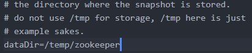
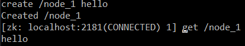
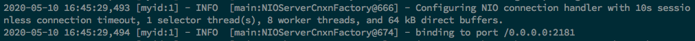
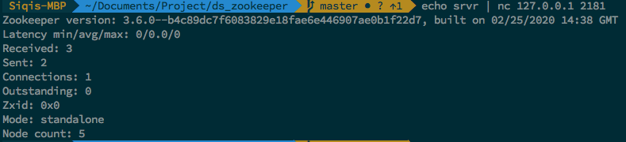
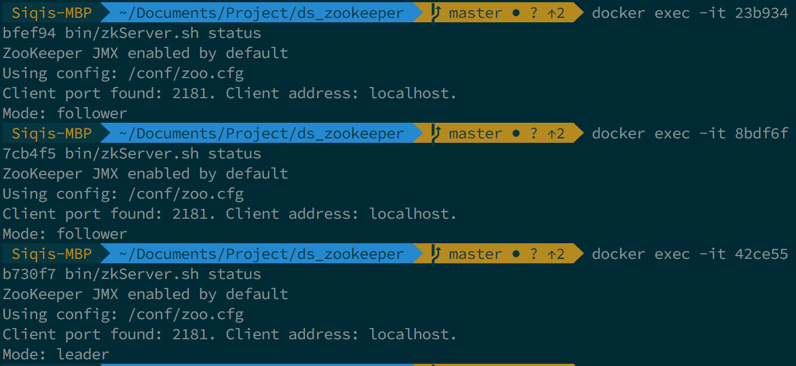
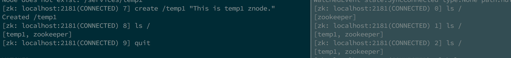

*by:* Mingyu Ma, Siqi Wang

# What Is Zookeeper?

Apache Zookeeper is a distributed system management tool. Zookeeper can provide service such as maintaining configuration information, naming, providing distributed synchronization, and providing group service. Zookeeper also provides you a way to do basic distributed system management functions such as leader election, locks in distributed system, and etc.

# Data Model in Zookeeper
Znode is the basic structure of a Zookeeper system. Znode have the following features. Since Zookeeper stores a tree like structure (znode) in the memory, each node has a limited size of the data (< 1MB).

- Znode can store data and have child znode;
- Znode can store information such as the current version of the data, transaction ID of the latest transaction;
- Access Control List allows each znode to have its own functions (create, read, write, delete, admin);
- Client can set watches on znode so that when a znode is changed, zookeeper can send a notification to the client;

## Types of Znode
1. Ephemeral ZNode

    The lifetime of the ephemeral znode is dependant on the session. Once the session is terminated, the znode will be deleted automatically. Although the ephemeral znode is associated with a connection between client and zookeeper server, it is visible for all the clients.

    > Ephemeral znode may not have children, not even ephemeral ones.

2. Persistent Znode

    Persistent znode is only deleted by manual delete operation from client side.

3. Sequential Znode

    Client could ask to create a znode with a monotonically increase number as a suffix of the path. Each sibling sequential znode has a unique number from the parent's point of view.

# ZooKeeper Services

The ZooKeeper service can run in two modes, **standalone mode** (development or test) and **replicated mode** (production). Conceptually, ZooKeeper's mission is to ensure that every modification to the tree of znodes is replicated to a majority of the ensemble. The other remaining replicas will eventually catch up with this state.

## Leader Election
ZooKeeper servers in an ensemble go through a process of electing a distinguished member, called the *leader*. The other machines are termed *followers*. Leader election is very fast, around 200 ms.

## Atomic Broadcast
All write requests all forwarded to the leader, which broadcasts the update to the followers. When a majority have persisted the change, the leader commits the update, and the client gets a response saying the update succeeded.

Every update made to the znode tree is given a globally unique identifier, called a **zxid**, which is ordered. If a `zxid z1` is less than `zxid z2`, then `z1` happened before `z2`.

## Sessions
A ZooKeeper client is configured with the list of servers in the ensemble. Once a connection has been established with a ZooKeeper server, the server creates a new session for the client. Sessions are kept alive by the client sending ping requests(aka heart-beats) whenever the session is idle for longer than a certain period. This is done automatically by the client library.

**Tick time** is the very basic period of time in ZooKeeper. Other settings are defined in terms of tick time. The session timeout, for example, may not be less than 2 ticks or more than 20.

## Watches
A ZooKeeper Watcher object allow clients to get notifications when a znode changes in some way and get notifications of changes in the ZooKeeper state. But watchers are triggered only once. To receive multiple notifications, a client needs to reregister the watch.

# How to install Zookeeper?

First download a latest Zookeeper on Apache website [**here**](https://zookeeper.apache.org/releases.html). Unpack the tar file and find the conf folder.
Inside conf folder, you can find a zoo_example.cfg file. In the file there is a command which sets the data directory, you should change that to a directory which can be accessed, do not leave it as tmp. After you finished, change the file name to zoo.cfg.



Finally you can run zkServer.cmd under the bin folder. If you successfully run it, it should create a standalone zookeeper server.
Then you can run zkCli.cmd to connect to the server. In that console you can operate on znodes.
First, let us create a new znode! Run the following command `create /node_1 hello` you would get your first znode. You can run `get /node_1` to get the information about this znode.



Remember znode's structure is a tree, you can create new znodes under any existing znode.
If you can run everything till this point, congratulation! You have successfully installed zookeeper.

## Configuration
Each server in the ensemble has a numeric identifier that is unique within the ensemble and must fall between 1 and 255. The number is specified in plain text in a file named `myid` in the directory specified by `dataDir` property. A ZooKeeper configuration file include all the servers in the ensemble. Each server is configued as `server.n=hostname:port:port`. `n` is the unique identifier. The first port is used for followers to connect to the leader. The second one is used for leader election.

Let's take a look at a sample config file for a three replicated ZooKeeper ensemble.
```bash
tickTime=2000 #time unit in ms used by Zookeeper
dataDir=./data/zookeeper1 #dir to store log info
clientPort=2181 #the port to listen for client connections
initLimit=5
syncLimit=2
server.1=localhost:2881:3881
server.2=localhost:2882:3882
server.3=localhost:2888:3888
```

## ZooKeeper command-line tools
ZooKeeper comes with a command-line tool for interacting with the ZooKeeper namespace: `bin/zkCli.sh -server`. There are nine basic operations in ZooKeeper (just like operate in a Unix/Linux file system).

|Operation|Description|
|--|--|
|create| create a znode(parent znode must already exist)|
| delete| delete a znode (must not have any childre)|
|exists|check if a znode exists and retreives its metadata|
|getACL, setACL| get/set the ACL|
|getChildren|get a list of the children of a znode|
|getData, setData| get/set the data associated with a znode|
|sync | sync a client's view of a znode|

## Starting a ZooKeeper Server

When a ZooKeeper server is booted up, it reads its id from `myid` file and then reads the config file to determin the ports it should listen on and discover the address of other servers in the ensemble.

### Running standalon zookeeper
Starting a standalon zookeeper server by running `bin/zkServer.sh start zoo.cfg`. Once you start a zookeeper server, some configuration information will be printed out. The image bellow shows a summary of using thread pool to handle incoming requests.


Check the status of a server by running `bin/zkServer.sh status` on the node. Alternatively, sending the four-letter words command to the client port using `echo srvr | nc 127.0.0.1 2181`, because we open the client port `2181` for the zookeeper server.



### Running replicated zookeeper
In order to provide availability, Zookeeper runs in replicated mode in production environment.

> It has to be odd number of servers.

Let's run a three-replicated Zookeeper in local environment using `docker-compose`. One of them will be selected as a leader.



If you are interested, you can play with the znodes among the servers. Check out the `docker-compose.yml` [file](https://github.com/WilliamMaa/gwAdvNet20.github.io/tree/master/wiki/zookeeper).



## Zookeeper's Java API
Zookeeper clients support language binding. For each binding, there is a choice between performing operations synchronously or asynchronously. Let's take a look at Zookeeper's Java API.

| ZoopKeeper API | sync | async|
|--|--|--|
|create| ✔︎| ✔︎|
|delete| ✔︎| ✔︎|
|exist| ✔︎| ✔︎|
|getData| ✔︎| ✔︎|
|setData| ✔︎| ✔︎|
|getACL| ✔︎| ✔︎|
|setACL| ✔︎| ✔︎|
|getChildren| ✔︎| ✔︎|
|sync| | ✔︎|
|createSession| ✔︎| |
|closeSession| ✔︎| |


# What can we do with zookeeper?
Zookeeper can provides you with a way to manage your distributed system. You can listen to changes in your system using zookeeper. You can implement a simple leader election algorithm to keep your system's data integrity.
Because zookeeper can listen to changes in the system, we can use it to connect to databases to monitor changes and synchronize the changes between different copies of the database.
In this project we are going to do a very simple demo of zookeeper. We are going to set up a zookeeper node that can be accessed by a spring boot server. This way we will have a zookeeper system that can be easily accessed. This provides a very basic framework which can be continue build upon.

In order to access zookeeper, we are going to use java spring boot framework.
First, we need to set pom.xml. In it we need to set spring boot and zookeeper java.

````xml
<dependency>
  <groupId>org.apache.zookeeper</groupId>
  <artifactId>zookeeper</artifactId>
  <version>3.6.1</version>
</dependency>
````

Then, to setup the spring boot server in Application.java file.

````java
import org.springframework.boot.SpringApplication;
import org.springframework.boot.autoconfigure.EnableAutoConfiguration;
import org.springframework.boot.autoconfigure.SpringBootApplication;

@SpringBootApplication
@EnableAutoConfiguration()
public class Application {
  public static void main(String[] args) {
    SpringApplication.run(Application.class, args);
  }
}
````

These should all be easy enough to done. Next is the part where we need to set the controllers for spring boot. This is also where you can alter the code to do other things using zookeeper. But this example will only try to access the znode we just created.

````java
import org.apache.zookeeper.WatchedEvent;
import org.apache.zookeeper.Watcher;
import org.apache.zookeeper.ZooKeeper;
import org.springframework.web.bind.annotation.RequestMapping;
import org.springframework.web.bind.annotation.RequestMethod;
import org.springframework.web.bind.annotation.RestController;

@RestController
public class RestController {

    @RequestMapping(value = "/zkget" ,method = RequestMethod.GET)
    public String zkget() {
        // watcher is the tool we used to monitor changes in znode
        Watcher watcher= new Watcher(){
            public void process(WatchedEvent event) {
                System.out.println("receive event：" + event);
            }
        };

        String value = null;
        try {
            final ZooKeeper zookeeper = new ZooKeeper("127.0.0.1:2181", 999999, watcher);
            final byte[] data = zookeeper.getData("/node_1", watcher, null);
            value = new String(data);
            zookeeper.close();
        } catch(Exception e) {
            e.printStackTrace();
        }
        return "get value from zookeeper [" + value + "]";
    }
}
````

Run this spring boot project on your local machine. In your browser or use the console to access `localhost:8080/zkget`, you will get the result from your zookeeper.
Through this simple example we had demonstrated how to use java to interact with zookeeper server, using the same setup you should be able to do something more complex than this. You can implement leader election algorithms, you can manage data changes using zookeeper. Basically zookeeper acts like the brain of your distributed system.


# Summary
You can use zookeeper to monitor your distributed system. A common way to do it is use Spring Boot. Because java has good compatibility with zookeeper, it can be very easy to build a system using the library provided. You can find more information on zookeeper website [**here**](https://zookeeper.apache.org/doc/r3.3.5/javaExample.html).
For questions about Spring Boot, the [**Spring Boot website**](https://spring.io/projects/spring-boot) provides some good tips for you to start.

# References
1. [**Zookeeper Installation**](https://zookeeper.apache.org/releases.html)
1. [**Zookeeper Java Example**](https://zookeeper.apache.org/doc/r3.3.5/javaExample.html)
1. [**Spring Boot Guide**](https://spring.io/projects/spring-boot)
1. [**ZooKeeper's Java API**](https://zookeeper.apache.org/doc/r3.4.6/api/org/apache/zookeeper/ZooKeeper.html)
